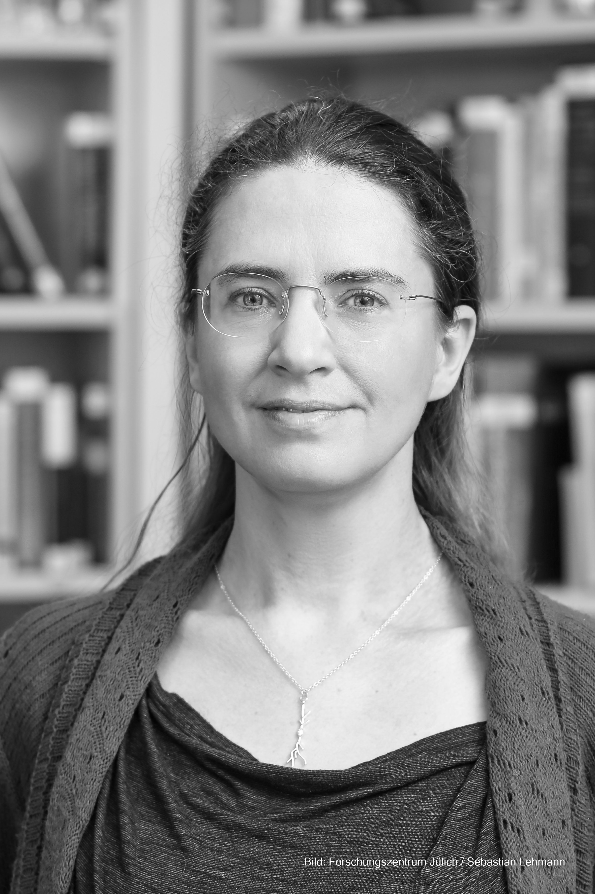

    

        

          
        

        

          Software Engineering 
          Department of Computer Science 3 
          RWTH Aachen University 
          Ahornstraße 55 
          D-52074 Aachen 
           
          +49 (241) 80-21308 
          <a href="mailto:morrison@se-rwth.de">morrison@se-rwth.de</a> 
           
          <a href="https://www.fz-juelich.de/profile/morrison_a">Computational and Systems Neuroscience (INM-6) 
          and Theoretical Neuroscience (IAS-6)</a>
        

    

