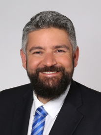

    

        

          
        

        

          Dipl.-Inform. Dipl.-Wirt.Inform. 
          Team Leader <a href="../../working-teams/team-MDSE">Model-Driven Systems Engineering </a>
          Software Engineering 
          Department of Computer Science 3 
          RWTH Aachen University 
          Ahornstraße 55 
          D-52074 Aachen 
           
          +49 (241) 80-21346 
          <a href="mailto:wortmann@se-rwth.de">wortmann@se-rwth.de</a> 
           
          Room 4219
           
          Twitter: <a href="https://twitter.com/andwor">@andwor</a>
        

    

 


### Research:

We investigate software & systems engineering through the lens of software languages. 
To this end, we conceive and develop, concepts, methods, and tools to facilitate efficient 
systems engineering with domain-specific software languages and language processing tools. 
This includes developing sophisticated language architectures for application in different domains 
including automated driving, the smart factories of Industry 4.0, and robotics.

To this end, the [model-driven systems engineering](../working-teams/team-MDSE) research group at the chair of Software 
Engineering concentrates on related research projects, such as [iserveU](https://www.se-rwth.de/materials/iserveu/) 
or [CrESt](https://crest.in.tum.de/). In this group,  we also conduct teaching and academic organization 
in the context of language-driven systems engineering. Part of these activities are illustrated below.



### Teaching:

Our research activities and their results influence the courses we offer. In the past, research in model-driven 
engineering, software language engineering, and their application to systems manifested in project classes and seminars.

#### Lectures and Exercises:

- Lecture [Informatik im Maschinenbau 1](https://www.se-rwth.de/teaching/ws1920/mbse/) (Summer 2020)
- Lecture [Model-based Software Engineering](https://www.se-rwth.de/teaching/ws1920/mbse/) (Winter 2019/20)
- Lecture [Software Language Engineering](https://www.se-rwth.de/teaching/ss18/sle/) (Summer 2018)
- Exercise [Softwaretechnik](https://www.se-rwth.de/teaching/ws1112/swt/) (Winter 2011/12)
- Exercise [Generative Software Engineering](https://www.se-rwth.de/teaching/ss11/gse/) (Summer 2011)

#### Project Classes: 

- Project class [Model-Driven Engineering the Industry 4.0](https://www.se-rwth.de/teaching/ws1819/lab/mde/) (Winter 2018/19)
- Project class [Model-Driven Engineering the Industry 4.0](https://www.se-rwth.de/teaching/ss18/lab/mde/) (Summer 2018)
- Project class [Model-Driven Engineering the Industry 4.0](https://www.se-rwth.de/teaching/ws1718/lab/mde/) (Winter 2017/18)
- Project class [Architecture Modeling Languages for Robotics](https://www.se-rwth.de/teaching/ss17/lab/) (Summer 2017)
- Project class [Model-based Development of Robotics Applications](https://www.se-rwth.de/teaching/ss14/robotics-lab/) (Summer 2014)
- Project class [Model-based Development of Robotics Applications](https://www.se-rwth.de/teaching/ws1314/lab_robotics/) (Winter 2013/14)
(in which we also developed a new [ROS node for the Sick S300](http://wiki.ros.org/sicks300) laser scanner)
- Project class [Model-based Development of Robotics Applications](https://www.se-rwth.de/teaching/ws1213/mbserob/) (Winter 2012/13)

#### Seminars:

- Seminar [A Journey into Software Language Workbenches](https://www.se-rwth.de/teaching/ws1819/seminar/sle/) (Winter 2018/19)
- Seminar [Model-based Software Development](https://www.se-rwth.de/teaching/ss12/mbse_seminar/) (Summer 2012)

Videos of the project classes' results and more are available on my [YouTube channel](https://www.youtube.com/channel/UCLGrX_2F2ZrsFH6YMryP-jA).

<iframe width="560" height="315" src="https://www.youtube.com/embed/TIspANC9TY4" title="YouTube video player" 
frameborder="0" allow="accelerometer; autoplay; clipboard-write; encrypted-media; gyroscope; picture-in-picture" 
allowfullscreen></iframe>

Our research also influences the bachelor theses and master theses we offer. Currently, we have 
interesting theses in the intersections of model-driven engineering, software language engineering, and robotics for you.



### Academic and Faculty Service:

In our faculty, I served in the 
[Commission for Teaching (KfL) of Computer Science at RWTH Aachen University](https://www.informatik.rwth-aachen.de/cms/Informatik/Studium/Serviceangebote/~midk/Kommission-fuer-Lehre/), 
in various appointment committees ("Berufungskommissionionen"), and coordinated the re-accreditation of our computer science courses.
Internationally, I organized or co-organized [ESEC/FSE 2019](https://esec-fse19.ut.ee/) 
[MODELS 2018](https://modelsconf2018.github.io/), SPLC 2018, the Workshop on Model-Driven Robotics 
Software Engineering in [2019](http://st.inf.tu-dresden.de/MORSE19/), [2018](http://st.inf.tu-dresden.de/MORSE18/), 
and [2017](http://st.inf.tu-dresden.de/MORSE17/); the Workshop on Robotics Software Engineering in 
[2019](https://rose-workshops.github.io/rose2019/) and [2018](https://sselab.de/lab9/public/wiki/RoSE18/index.php?title=Main_Page) 
and serve in its [steering committee](https://rose-workshops.github.io/people/); the International Workshop on Interplay 
of Model-Driven and Component-Based Software Engineering in [2019](http://www.es.mdh.se/ModComp/) and 2018; the 
[1st Workshop on Pains in Model-Driven Engineering Practice](https://sites.google.com/view/pains-2018/home), 
[5th International Workshop on the Globalization of Modeling Languages (GEMOC)](https://gemoc.org/events/gemoc2017.html), 
and [Tutorial on Language Engineering with The GEMOC Studio at ICSA 2017](http://icsa-conferences.org/2017/call-for-papers/tutorials/) 
([Tutorial Website](https://github.com/gemoc/ICSA2017Tutorial)).

Besides this, I served in program committees of various conferences and workshops including MODELS 2020, CommitMDE 2019, 
JRC of STAF 2019, MiSE 2019, SEAA 2019, IRC 2019, ME 2018, EXE 2018, GEMOC 2018 CommitMDE 2018, SLE 2018, MODELS 2018 
Tools Track, CBI 2018, SPLTea 2018, SEAA 2018, MEKES 2018, IRC 2018, EXE 2017, SLE 2017, IRC 2017, ETFA 2017, MiSE 2017,
MORSE 2016, ETFA 2016, DSLRob 2015, MORSE 2015, ETFA 2015, DSLRob 2014.

Moreover, I also reviewed for various journals, including: Journal on Software and Systems Modeling, the Journal of 
Systems and Software, Journal of Empirical Software Engineering, Journal of Software Engineering for Robotics, 
Journal of Business & Information Systems Engineering, Journal of Computer Standards & Interfaces, Business & 
Information Systems Engineering

I also serve in the editorial board of the [Journal of Automotive Software Engineering (JASE)](https://www.atlantis-press.com/journals/jase) as well as 
in the board of the [European Association for Programming Languages and Systems (EAPLS).](https://eapls.org/)

### Publications:

Of course, our research manifests in publications related to modeling, language engineering, and applying it to 
robotics as well. We, therefore, also prepared [curated lists on these topics](/research) for you.

  



### Miscellanea:

- My [Erdös Number](https://en.wikipedia.org/wiki/Erd%C5%91s_number) is four: I coauthored with 
Bernhard Rumpe, who coauthored with S. Shankar Sastry, who coauthored with Béla Bollobás, 
who coauthored with Paul Erdös.
- There is a [XKCD comic on this.](https://xkcd.com/599/)
- I am a member of the 
[IEEE RAS Technical Committee of Software Engineering for Robotics and Automaton (TC-SOFT).](https://www.ieee-ras.org/software-engineering-for-robotics-and-automation/activities)
- A short vita can be found on my [personal website.](https://awortmann.github.io/)

