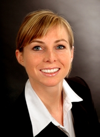

    

        

          
        

    

 


### Responsibilites:

- Academic project acquisition
- Industrial project acquisition
- Leader of the working group Cloud Computing/SaaS
- Project leader and implementation within industrial projects
- Manager of SE Lab



### Research Areas:

#### Topics:

- Cloud Computing, Software as a Service
- Service Integration
- Data and Tool Integration
- Consistency Management in Design Processes
- Software Architectures

#### Techniques

- Model-based Development
- Framework Development
- Language Extensions
- Model Transformation
- Graph Grammars



### Projects/Experience:

See also my page at [XING](http://www.xing.com/profile/AnneTherese_Koertgen)

<table style="margin-bottom: 1rem;">
  <tr>
    <th>Project name and description</th>
    <th>Position</th>
    <th>Date</th>
  </tr>
  <tr>
    <td>Software for cloud platforms: characteristics, model-based development, architecture, interfaces, domain modeling, service integration</td>
    <td>Project leader</td>
    <td>1 year (03/10 - 01/11)</td>
  </tr>
  <tr>
    <td>IT analysis and specifications in multiple projects in the energy trading sector</td>
    <td>IT Architect at Platinion GmbH, Cologne</td>
    <td>5 months (09/09 - 01/10)</td>
  </tr>
  <tr>
    <td>Tools for consistency management between design products (subproject T5 of TB 61 in cooperation with Comos Industry Solutions GmbH)</td>
    <td>Project leader, developer</td>
    <td>3 years (07/06 - 06/09)</td>
  </tr>
  <tr>
    <td>Applications and Simulation in eHomes</td>
    <td>Project leader</td>
    <td>6 months part time (09/07 - 02/08)</td>
  </tr>
  <tr>
    <td>Model-based wrapper development (subproject I3 of SFB 476)</td>
    <td>Student assistant, developer</td>
    <td>4 years (03/02 - 05/06)</td>
  </tr>
  <tr>
    <td>Analysis and evaluation of onboard diagnostic data of the Eurofighter</td>
    <td>Developer at EADS Division Defence and security Systems, Munich</td>
    <td>3 months (08/04 - 10/04)</td>
  </tr>
  <tr>
    <td>Implementation of web applications in multiple projects</td>
    <td>Developer at tops.net, Bonn</td>
    <td>4 months (05/00 - 09/00)</td>
  </tr>
  <tr>
    <td>Server administration and maintenance at clients office, PC and network installations</td>
    <td>Freelancer for Jörn Ott EDV-Service & Beratung, Bad Honnef</td>
    <td>2 years (1998 - 2000)</td>
  </tr>
</table>



### Publications:

  



### Teaching: 

- Seminar im Hauptstudium (Winter 2006): Unterstützung modellgetriebener Entwicklungsprozesse
- Projektpraktikum im Hauptstudium (Summer 2007): Prozessmanagement und Dokumentenintegration
- Softwarepraktikum im Grundstudium (Winter 2007): Entwicklung von komponentenbasierten eHome-Diensten
- Vorlesung (Summer 2008): Die Sofwaretechnik-Programmiersprache Ada95
- Projektpraktikum im Hauptstudium (Winter 2008):Graph-basierte Werkzeuge & Modellgetriebene Entwicklung
- Vorlesung (Winter 2010): Angewandte Softwaretechnik im Lebenszyklus der Automobilelektronik



### Education:

- 2000-2006 - Study of Computer Science with focus on Software Engineering, RWTH Aachen, Germany
- 2006-2009 - PhD student at the Department of Computer Science 3 (Software Engineering) at the Aachen University of Technology (RWTH Aachen), Germany