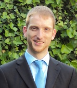

    

        

          
        

        

          Software Engineering 
          Department of Computer Science 3 
          RWTH Aachen University 
          Ahornstraße 55 
          D-52074 Aachen 
           
          <a href="mailto:schulze@se-rwth.de">schulze@se-rwth.de</a> 
           
          Room 4303
        

    

 


### Publications:

  



### Completed Theses:

- Bachelor Thesis: Structural Compatibility Analysis of Software Components
- Bachelor Thesis: Transformation von Simulinkmodellen zu erweiterten I/O Automaten
- Bachelor Thesis: Development of a Table Editor for Sequence-based Requirement Specification
- Bachelor Thesis: Empirical Research in Software Engineering
- Bachelor Thesis: Semantische Ähnlichkeitsanalysen auf Basis extrahierter Teststimuli
- Master Thesis: Testbasierte Kompatibilitätsanalysen von Funktionskomponenten
- Master Thesis: Automated evaluation of function component compatibility in the context of evolution and variability
- Master Thesis: AUTOSAR-compliant Software Development with MontiArc
- Master Thesis: Development of a domainspecific language for visual outline generation in MontiCore
- Master Thesis: Development of a Generic Editor Framework for MontiCore
- Master Thesis: Interactive Software Design Document Generation Framework For The Automotive Industry
- Master Thesis: Efficient architectural design for the automotive industry
- Master Thesis: Similarity Analysis Framework for Software Product Line Extraction



### Teaching:

- Proseminar: [Best Practices of Modern and Efficient Software Engineering (Summer 2016)](https://www.se-rwth.de/teaching/ss16/proseminar/)
- Seminar: [Selected Topics in Software Engineering (Summer 2016)](https://www.se-rwth.de/teaching/ss16/seminar/)
- Seminar: [Selected Topics in Software Engineering (Winter 2015/16)](http://www.se-rwth.de/teaching/ws1516/seminar_se/)
- Seminar: [Selected Topics in Software Engineering (Winter 2014/15)](http://www.se-rwth.de/teaching/ws1415/seminar_se/)
- Practical course: [Model-based Development of Robotics Applications (Summer 2014)](http://www.se-rwth.de/teaching/ss14/robotics-lab/)
- Practical course: [Model-based Development of Robotics Applications (Winter 2013/14)](http://www.se-rwth.de/teaching/ws1314/lab_robotics/)
- Proseminar: [Best Practices of Modern and Efficient Software Engineering (Summer 13)](https://www.se-rwth.de/teaching/ss13/proseminar/)
