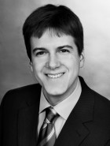

    

        

          
        

        

          Software Engineering 
          Department of Computer Science 3 
          RWTH Aachen University 
          Ahornstraße 55 
          D-52074 Aachen 
           
          <a href="mailto:retkowitz@i3.informatik.rwth-aachen.de">retkowitz@i3.informatik.rwth-aachen.de</a> 
        

    

 


### Research Areas:

I am currently working in the eHome research group of our department. My special interests are the dynamic 
composition and configuration of software components implementing eHome services and the semantic specification 
of such services. Smart environments are changing dynamically with respect to user requirements and available 
device functionality. This has to be considered in a continuous process of specification, configuration, and deployment. 
We develop a new tool to provide for an automated, dynamic service composition respecting dynamic changes. Furthermore,
we extend the means of semantic annotation of service specifications that form the basis of the composition process. 
The respective composition algorithm is extended accordingly.

Before, I worked in the ConDes project of our department. The goal of this project was to develop new software tools 
for conceptual building design. Within this project I developed concepts for composition of conceptual design rules. 
We extended our tools for knowledge specification to support rule dependencies. Furthermore, our algorithm for the 
analysis of conceptual designs has been extended to support complex design rules that are composed of basic rules.



### Publications:

  



### Talks:

- Softwareunterstützung für adaptive eHome-Systeme, Oberseminarvortrag, RWTH Aachen University, Germany. January 2010.
- Softwareunterstützung für adaptive eHome-Systeme, Invited Talk, Distributed Systems Group, University of Kassel, Germany. November 2009.
- Towards Mobility Support in Smart Environments, 21st International Conference on Software Engineering and Knowledge Engineering (SEKE 2009). Boston, Massachusetts, USA. July 2009.
- Dependency Management in Smart Homes, 9th IFIP WG 6.1 International Conference on Distributed Applications and Interoperable Systems (DAIS 2009). Lisbon, Portugal. June 2009.
- Ontology-based Configuration of Adaptive Smart Homes, 7th Workshop on Adaptive and Reflective Middleware (ARM'08) at the 9th International Middleware Conference. Leuven, Belgium. December 2008.
- Dynamic Adaptability for Smart Environments, 8th IFIP WG 6.1 International Conference on Distributed Applications and Interoperable Systems (DAIS 2008). Oslo, Norway. June 2008.
- Rule-Dependencies for Visual Knowledge Specification in Conceptual Design, 11th International Conference on Computing in Civil and Building Engineering (ICCCBE-XI). Montréal, Canada. June 2006.
- Rule-Dependencies for Visual Knowledge Specification in Conceptual Building Design, Graduate School Software for Mobile Communication Systems, RWTH Aachen University, Germany. May 2006.
- Operationale Semantikdefinition für konzeptuelles Regelwissen, 17th Forum Bauinformatik. Brandenburg University of Technology, Cottbus, Germany. September 2005.



### Teaching:

- Summer 2009: Seminar: Software Architectures – Different Forms and New Aspects
- Winter 2008/2009: Lecture: Software Architectures (TGGS)
- Winter 2008/2009: Lecture: Software Architectures
- Winter 2008/2009: Seminar: Current Trends in Software Engineering
- Summer 2008: Lab Course: Workflow-Based Services for eHomes
- Winter 2007/2008: Lecture: Software Architectures (TGGS)
- Winter 2007/2008: Lab Course: Software Tools for Smart Environments
- Summer 2007: Seminar: Component-based context-aware eHome systems
- Winter 2006/2007: Lecture: Introduction to Software Engineering
- Summer 2006: Lab Course: Mobility in eHomes



### Supervised Theses:

- Marvin Hoffmann: Ontologiebasierte Komposition von eHome-Diensten (Bachelor Thesis)
- Sven Kulle: Dynamische Bindungsverwaltung zur bedarfsorientierten Ressourcennutzung von eHome-Diensten (Diploma Thesis)
- Ralf Frotscher: Adaptives Kontextmanagement für dynamische eHomes (Bachelor Thesis)
- Monika Pienkos: Semantische Spezifikation und Adaption von eHome-Diensten (Diploma Thesis)
- Chengzhi Xue: Laufzeitkontrolle von Diensten in dynamischen eHome-Systemen (Diploma Thesis)
- Mark Stegelmann: Spezifikation und Komposition von Diensten in dynamischen eHome-Systemen (Diploma Thesis)



### Other Activities: 

- Assistant Lecturer at the Thai-German Graduate School of Engineering (TGGS) at King Mongkut's University of Technology North Bangkok (KMUTNB), February 2009, Bangkok, Thailand.
- Member of the Organizing Committee of the 4ING Conference, July 2008, Aachen, Germany.
- Assistant Lecturer at the Thai-German Graduate School of Engineering (TGGS) at King Mongkut's University of Technology North Bangkok (KMUTNB), February 2008, Bangkok, Thailand.
- Member of the Search Committee for the Ultra High-Speed Mobile Information and Communication (UMIC) research cluster established under the excellence initiative of the German government, RWTH Aachen University, 2007-2008.
- Member of the Organizing and Program Committee of the 1st International Workshop on Mobile Services and Personalized Environments 2006, November 2006, Aachen, Germany.
- Prototype Demonstration and Poster Presentation Software für das intelligente Haus at the Informatics Year 2006 Regional Event Aachen, May 2006, Aachen, Germany.
- Member of the Organizing Committee of the Informatics Year 2006 Regional Event Aachen, May 2006, Aachen, Germany.
- Prototype Demonstration The eHome Prototype at Girls' Day, April 2006, Aachen, Germany.
- Prototype Demonstration and Poster Presentation eHome Specification, Configuration, and Deployment, Tag der Informatik, December 2005, Aachen, Germany.

