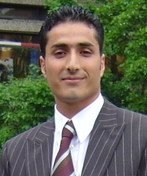

    

        

          
        

        

          Software Engineering 
          Department of Computer Science 3 
          RWTH Aachen University 
          Ahornstraße 55 
          D-52074 Aachen 
           
          +49 (241) 80-21317 
          <a href="mailto:armac@se-rwth.de">armac@se-rwth.de</a> 
           
          Building E1, Room 4220
           
          
 Please note: I left SE on October 1st, 2010. 
            
        

    

 



### Publications:

  



### Talks:

- Privacy-Friendly Smart Environments. Third International Conference and Exhibition on Next Generation Mobile Applications, Services and Technologies (NGMAST 2009), Cardiff, UK, October 2009.
- Personalisierte, mobile eHomes: Privatsphäre und Sicherheit. Invited Talk at University of Siegen, Siegen, Germany, August 2008.
- Protecting the Privacy of Mobile eHome Users. Workshop of German Computer Science Graduate Schools, Dagstuhl, Germany, May 2008.
- Client Side Personalization of Smart Environments. 1st International Workshop on Software Architectures and Mobility 2008 (SAM 2008), Leipzig, Germany, May 2008.
- Protecting the Privacy of Mobile eHome Users. Graduate School "Software for Mobile Communication Systems", RWTH Aachen, Germany, April 2008.
- Simulation of Smart Environments, International Conference on Pervasive Services 2007 (ICPS 2007), Istanbul, Turkey, July 2007.
- Frictionless Service Interaction in Protected Areas: Collaboration in eHomes. Ubiquitous Mobile Information and Collaboration Systems Workshop (UMICS), Trondheim, Norway, June 2007.
- Protecting Privacy of Mobile eHome Users. Workshop of German Computer Science Graduate Schools, Dagstuhl, Germany, June 2007.
- Specification, Configuration, and Deployment in eHomes. Distributed Systems and Networking Group, RMIT University, Melbourne, Australia, December 2006.
- Modeling eHome Systems. 4th Intl. Workshop on Middleware for Pervasive and Ad-Hoc Computing (MPAC), Melbourne, Australia, November 2006.
- Mobility and Privacy in Virtual Home Environments. International Research Training Groups Workshop (IRTG), Dagstuhl, Germany, November 2006.
- The eHomeConfigurator Tool Suite. 1st International Workshop on Pervasive Systems (PerSys 2006), Montpellier, France, October 2006.
- Process Support in eHome Systems: Empowering Providers to Handle a Future Mass Market. Ubiquitous Mobile Information and Collaboration Systems Workshop (UMICS), Luxembourg, May 2006.
- Modeling and Analysis of Functionality in eHome Systems: Dynamic Rule-Based Conflict Detection. 13th IEEE International Conference on the Engineering of Computer Based Systems (ECBS), Potsdam, Germany, March 2006.
- Virtual eHomes. Graduate School "Software for Mobile Communication Systems", RWTH Aachen, Germany, August 2005.



### Teaching:

- Lecture SS 2010 / WS 2011: Software Engineering Lab im Bachelor-Studiengang an der GUTech in Muskat, Oman
- [Lecture SS 2010:](https://www.se-rwth.de/teaching/ss10/glose/) Softwaretechnik-Projektpraktikum im Dipl.-Hauptstudium/Master: Global Software Engineering
- [Lecture WS 2009/2010:](https://www.se-rwth.de/teaching/ws0910/seminar/) Seminar: Modelltransformationstechniken und Meta-CASE-Tools
- Lecture SS 2009: Softwaretechnik-Projektpraktikum im Dipl.-Hauptstudium/Master: Modellbasierte Werkzeugentwicklung - Handhabung von Software-Varianten in der Automotive Domäne
- Lecture WS 2008/2009: Einführung in die Softwaretechnik (Introduction to Software Engineering)
- Lecture WS 2008/2009: Modellierung von Software-Architekturen (Modeling of Software Architectures)
- Proseminar SS 2008: Pioniere in der Softwaretechnik
- Softwarepraktikum im Grundstudium WS 2007/2008: Entwicklung von komponentenbasierten eHome-Diensten
- Seminar SS 2007: Komponentenbasierte, kontextbezogene eHome-Systeme
- Softwarepraktikum im Grundstudium WS 2006/2007: Entwicklung eines webbasierten Fußball-Tippportals
- Projektpraktikum SS 2006: Mobilität in eHomes
- Seminar WS 2005/2006: Visuelle Spezifikationssysteme und ihre Anwendung in eHome-Systemen
- Proseminar SS 2005: Objektorientierte Softwareentwicklung in Eiffel



### Other Activities:

- Ibrahim Armac: Member of the organization committee of the 4ING conference, Aachen, Germany, July 2008.
- Ibrahim Armac: Member of the search committee for the "Software Engineering" chair at RWTH Aachen University, Aachen, Germany, 2008.
- Ibrahim Armac: Member of the Computer Science Faculty Council at RWTH Aachen University, Aachen, Germay, 2006-2008.
- Ibrahim Armac: Organizer of the Computer Science soccer tournaments 2007, 2008, and 2009, at RWTH Aachen University, Aachen, Germany.
- Ibrahim Armac: Protecting the Privacy of Mobile eHome Users, Prototype demonstration at the Workshop of German Computer Science Graduate Schools, Dagstuhl, Germany, May 2008.
- Ibrahim Armac: Simulation of Smart Environments, Prototype demonstration at ICPS 2007, Istanbul, Turkey, July 2007.
- Ibrahim Armac: The eHomeSimulator, Prototype demonstration at UMICS 2007, Trondheim, Norway, June 2007.
- Ibrahim Armac: Member of the organizing and program committee of the 1st International Workshop on Mobile Services and Personalized Environments 2006, Aachen, Germany, November 2006.
- Ibrahim Armac: Member of the organizing committee of the Regional Event within Informatics Year 2006, RWTH Aachen, Aachen, May 2006.'
- Ibrahim Armac, Daniel Retkowitz: The eHome Prototype, Prototype demonstration, Girls' Day, Aachen, Germany, April 2006.
- Ulrich Norbisrath, Ibrahim Armac, Daniel Retkowitz: eHome Specification, Configuration, and Deployment, Prototype demonstration and poster presentation, Tag der Informatik, December 2005, Aachen, Germany.
