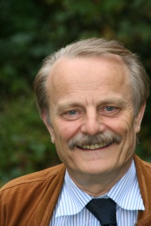

    

        

          
        

        

          Software Engineering 
          Department of Computer Science 3 
          RWTH Aachen University 
          Ahornstraße 55 
          D-52074 Aachen 
           
          +49 241 80-21350 
          <a href="mailto:nagl@se.rwth-aachen.de">nagl@se.rwth-aachen.de</a> 
        

    

 


## Research Interests:

- Tools for Software Development, Chemical Engineering, Author Support, Civil Engineering etc.
- Management of Development Processes
- Graph Rewriting Systems: Theory and Applications
- Meta Tool Environments: Specifications by Graph Rewriting, Code Generation, Framework, 
Non-standard Database Systems, A-priori and A-posteriori Integration of Tools
- Programming Languages for Large Systems
- Architecture Modeling of Software Systems
- Gothic Style Churches and Informatics
- Studies in Sociology and Science Policy



## Important Scientific Projects and Positions:

- Chairperson Steering Committee [Department Evaluations](https://www.informatics-europe.org/services/department-evaluation.html) 
of [Informatics Europe](https://www.informatics-europe.org/) 11/10 -
- Chairperson Substitute Accreditation Committee [EQANIE](https://eqanie.eu/) 5/10 - 12/16
- Chairperson [Fakultätentag Informatik](https://www.ft-informatik.de/) 06-08 (Informatics Deans’ Conference, Germany), 
Chairperson Substitute [Fakultätentag Informatik](https://www.ft-informatik.de/) 09-11
- Chairperson [4ING](http://www.4ing.net/), Fakultätentage Ingenieurwissenschaften und Informatik 07-08 
(Umbrella Org. of Deans‘ Conferences Mech., Electr., Civil Engineering, and Informatics, Germany), 
Member of [4ING](http://www.4ing.net/) Board 06-11
- Member of the Board of Informatics Europe 9/05-11/07, 11/11-12/15
- Speaker DFG Transferbereich 61, 06-09
- Speaker DFG [Sonderforschungsbereich](http://www-i3.informatik.rwth-aachen.de/research/sfb476/index.html) 476 IMPROVE 97-06
- Speaker DFG Forschergruppe SUKITS 90-97
- Speaker Substitute [REGINA](https://regina.ac/) 3/00-3/08, Member of the REGINA Board 3/95-3/07
- Member of the Board Forum Informatik RWTH 88-3/07
- Member of the Senate of RWTH 87-90, 02-06, Member Substitute 06-08
- Member of the Comission for Structure and Finance of the Senate 97-02
- Chairperson [Fachgruppe Informatik](https://www.informatik.rwth-aachen.de/go/id/mxz/?lidx=1) 
(Informatics Department) 10/03 – 10/05, Chairperson Substitute 10/05 - 10/07
- Responsible for Finance, Structure Data and Building of Fachgruppe Informatik 97-02
- Different Activities for Gesellschaft für Informatik 12-
- Board Member Region Aachen, Deutscher Hochschulverband 12-
- Diverse further Academic Positions in the Faculty and University
- Having supervised 46 Ph.D. projects



## Short CV:

	

		

			
08/09-

			
Professor emeritus

		

		

			
1995-

			
Also Member of the Faculty of Electrical Engineering and Information Technology RWTH

		

		

			
1992-

			
Offer from University of Zürich, Switzerland, rejected

		

		

			
1986-

			
Member of the Faculty of Mathematics, Informatics, and Natural Sciences RWTH

		

		

			
1986-2009

			
Full Professor Informatics (Software Engineering), RWTH Aachen University

		

		

			
1981-1986

			
Full Professor Applied Informatics, University of Osnabrücks

		

		

			
1979-1981

			
Associate Professor Informatics, University of Koblenz-Landau

		

		

			
1979

			
Habilitation at University of Erlangen-Nuremberg, Dr.-Ing. habil.

		

		

			
1974-1979

			
Dr.-Ing., University of Erlangen-Nuremberg, Engineering Science Faculty

		

		

			
1969-1971

			
Research Lab Siemens AG Erlangen, Graphics Software

		

		

			
1963-1969

			
Studies Mathematics/Physics at University of Erlangen-Nuremberg, Master 1969

		

	

 



### Honors:

	

		

			
2014

			
Lehrpreis RWTH, 2. Platz für Mentoring der Fachgruppe Informatik

		

		

			
2014

			
Fellow des Fakutätentagsverbundes 4ING

		

		

			
11/2010

			
Ehrendoktorwürde der Fakultät für Elektrotechnik, Informatik und Mathematik 
                der Universität Paderborn, Dr.rer.nat.h.c.
            

		

		

			
2009

			
Fellow der Gesellschaft für Informatik

		

		

			
11/2010

			
Festschrift, Buch in der Reihe Lecture Notes in Computer Science des 
                    Springer-Verlags verfasst von ehemaligen Mitarbeitern und Kollegen anlässlich der Emeritierung:
                    G. Engels, C. Lewerentz, W. Schäfer, A. Schürr, B. Westfechtel (Eds.): Graph Transformations and 
                    Model-Driven Engineering, LNCS 5765, 768pp., 2010
            

        

		

			
1/2009

			
Ehrennadel des Fakultätenverbundes 4ING (Fakutätentage der Ingenieurwissenschaften 
                und der Informatik an Universitäten in Deutschland e.V.)
            

		

		

			
2008

			
Ehrenmitglied des Regionalen Industrieclubs Informatik (Regina) e.V.

		

	

 



## Important Research Projects:

	

		

			
2006-2009

			
Initiating (since 05) and leading (7/06 - 6/09) DFG Transfer Center 61,  
            1 period, 6 subprojects, 3 partners,  
            Funding DFG about 1.292.000 €  
            see special issue 35 of Computer & Chemical Engineering
            

		

		

			
1997-2006

			
Initiating (since 94) and leading (since 97) Collaborative Research Center 
            476 IMPROVE (DFG Sonderforschungsbereich),   3 periods, 12 subprojects, 6 partners (Chemical Engineering, 
            Plastics Technology, Labor Research and 3 groups from Informatics),   Funding DFG about 8.456.000 €  
            see LNCS volume 4970, Springer 2008
            

		

		

			
1990-1997

			
Initiating (since 88) and leading (since 90) DFG Research Group SUKITS "Software  
            and Communication in Technical Systems", 2 periods of funding, 4 subprojects and 4 partners (Mechanical 
            Engineering and Informatics),  
            Funding about 1.342.000 €  
            see book published by Springer 1999
            

		

		

			
1982-1996

			
IPSEN "Tightly Integrated Software Development Tools", Funding by DFG,  
                VW-Stiftung, BMBF, Lower Saxony, North Rhine-Westphalia,  
                total effort 110 person years  
                see LNCS volume 1170, Springer 1996
            

		

	

 



## Important Quality Assurance Activities for Research and Teaching:

	

		

			
2008-

			
Mitgliedschaft (Vorsitz) in Akkreditierungskommitees, Prag, Riga, Tallin, Kaunas, Tartu, Portugal, Cardiff, u.a.

		

		

			
1989-

			
47 Mitgliedschaften in Bewertungskomissionen und Beiräten, Coach für große Forschungsprojekte (wie SFBs, Exzellenzprojekte) sowie Forschungsbewertung von Fakultäten

		

		

			
1975-

			
Organisation von 38 Workshops und Konferenzen

		

		

			
1975-

			
Mitglied (teilw. Vorsitzender) von 100 Programm-Komitees

		

		

			
1975-

			
Zahlreiche Bewertungen von Forschungsprojekten für DFG, BMBF, VW-Stiftung, etc. 
                in Deutschland und für entspr. Organisationen in USA, Niederlanden, Schweden, Israel, Österreich, 
                Frankreich, Kanada, UK, Südafrika und Schweiz
            

		

		

			
1975-

			
Zahlreiche Bewertungen von Einreichungen für Journale

		

		

			
1972-

			
Mitglied (teilw. Vorsitzender) von etwa 48 Berufungskommissionen, 30 in der 
                Informatik in Erlangen, Koblenz und Aachen, 18 in anderen Fakultäten in Aachen (Maschinenbau, 
                Elektrotechnik, Architektur, Bauingenieurwesen, Materialwissenschaften und Medizin)
            

		

	

 



## PhDs of the Group, Habilitation 47:

- R. Gall: (Betreuung mit Prof. Schneider, Erlangen) über Programmieren im Großen mit Graph-Grammatiken, Diss. Univ. Erlangen, 224 S., IMMD-Bericht, 16,1, 1983
- M. Kaul: Präzedenz-Graph-Grammatiken, Diss. Univ. Osnabrück, 236 S., 1985
- M. Jackel: Spezifikation der Nebenläufigkeitskonstrukte von Ada mit Graph-Grammatiken, Diss. Univ. Osnabrück, 220 S., 1986
- G. Engels: Graphen als zentrale Datenstrukturen in einer Softwareentwicklungs-Umgebung, Diss. Univ. Osnabrück, 196 S., VDI-Verlag, 1986
- W. Schäfer: Eine integrierte Softwareentwicklungs-Umgebung: Konzepte, Entwurf und Implementierung, Diss. Univ. Osnabrück, 259 S., VDI-Verlag, 1986
- C. Lewerentz: Konzepte und Werkzeuge zum interaktiven Entwerfen großer Programmsysteme, Diss. RWTH Aachen, 179 S., Informatik-Fachberichte 194, Springer-Verlag, 1988
- B. Westfechtel: Revisions- und Konfigurationskontrolle in einer integrierten Softwareentwicklungs-Umgebung, Diss. RWTH Aachen, 321 S., Informatik-Fachberichte 280, Springer-Verlag, 1991
- A. Schürr: Operationales Spezifizieren mit programmierten Graphersetzungen, Diss. RWTH Aachen, 461 S., Deutscher Universitätsverlag, 1991
- Th. Janning: Integration von Sprachen und Werkzeugen zum Requirements Engineering und Programmieren-im-Großen, Diss. RWTH Aachen, 174 S., Deutscher Universitätsverlag, 1992. Herr Janning ist derzeit Geschäftsführer und Mitinhaber einer Softwarefirma.
- J. Börstler: Programmieren-im-Großen: Sprachen, Werkzeuge, Wiederverwendung, Diss. RWTH Aachen, 205 S., Umea: Umea University Press, 1994
- M. Lefering: Integrationswerkzeuge in Softwareentwicklungs-Umgebung, Diss. RWTH Aachen, 253 S., Aachen: Shaker-Verlag, 1995
- V. Bacvanski: Integration and Structuring of Expert Systems in Technical Applications, Diss. RWTH Aachen, 225 S., 1995
- A. Zündorf: Eine Entwicklungsumgebung für PROgrammierte GRaphersetzungs-Systeme (Spezifikation, Implementierung und Verwendung), Diss. RWTH Aachen, 374 S., Deutscher Universitäts-Verlag 1996. Herr Zündorf hat bei Prof. Schäfer, Paderborn, habilitiert.
- M. von der Beeck: Ein Kontrollmodell für die Strukturierte Analyse, Diss. RWTH Aachen, 282 S., 199
- Chr. Kohring: Ausführung von Anforderungsdefinitionen zum Rapid Prototyping - Requirements Engineering und Simulation (RESI) -, Diss. RWTH Aachen, 293 S., Shaker-Verlag, 1996
- C.-A. Krapp: An Adaptable Environment for Management of Development Processes, Diss. RWTH Aachen, 196 S., Aachener Berichte zur Informatik 22, Augustinus-Verlag 1998. Herr Krapp ist ltd. Angest. in einem Softwarehaus in New York.
- B. Westfechtel: Models and Tools for Managing Development Processes, Habilitationsschrift, RWTH Aachen, 1998, 418 S., Lect. Notes in Comp. Sci. 1646, Springer-Verlag, 1998
- K. Cremer: Graphbasierte Werkzeuge zum Reverse Engineering und Reengeneering, Diss. RWTH Aachen, 1999, 220 S., Deutscher Universitätsverlag, 2000
- R. Baumann: Ein Datenbankmanagementsystem für verteilte, integrierte Software-Entwicklungsumgebungen, Diss. RWTH Aachen, 1999, 236 S., Aachener Berichte zur Informatik 26, Wissenschaftsverlag Mainz, 2000
- A. Behle: Wiederverwendung von Softwarekomponenten im Internet, Diss. RWTH Aachen, 1999, 286 S., Deutscher Universitätsverlag, 2000
- S. Gruner: Eine schematische und grammatische Korrespondenzmethode zur Spezifikation konsistent verteilter Datenmodelle, Diss. RWTH Aachen, 1999, 218 S., Shaker-Verlag, 1999
- A. Winter: Visuelles Programmieren mit modularen Graphtransformationen, Diss. RWTH Aachen, 1999, 347 S., Aachener Berichte zur Informatik 27, Wissenschaftsverlag Mainz, 2000
- A. Radermacher: Tools Support for the Distribution of Object-based Applications, Diss. RWTH Aachen 2000, 190 S., Internet-Veröffentlichung
- E. Pritsch: Flexible Zugriffskonzepte für Verteilte Informationssysteme, Diss. RWTH Aachen, 253 S., Shaker-Verlag, Aachen, 2000
- P. Klein: Architecture Modelling of Distributed and Concurrent Software Systems, Diss. RWTH Aachen, 2000, 237 S., Aachener Berichte zur Informatik 31, Wissenschaftsverlag Mainz, 2000
- A. Schleicher: Roundtrip Process Evolution Support in a Wide Spectrum Process Management System, Diss. RWTH Aachen, 310 S., Deutscher Universitätsverlag, Wiesbaden, 2002
- D. Jäger: Unterstützung übergreifender Kooperation in komplexen Entwicklungsprozessen, Diss. RWTH Aachen, 260 S., Aachener Berichte zur Informatik 34, Wissenschaftsverlag Mainz, Aachen, 2003
- M. Münch: Generic Modeling with Graph Rewriting Systems, Diss. RWTH Aachen, 242 S., Shaker-Verlag, Aachen, 2003
- D. Herzberg: Modelling Telecommunikation Systems: From Standard to System Architectures, Diss. RWTH Aachen, 305 pp., 2003
- F. Gatzemeier: CHASID: A Semantics-oriented Authoring Environment, Diss. RWTH Aachen, 284 S., 2004, Shaker-Verlag, 2005
- A. Marburger: Reverse Engineering of Complex Legacy Telecommunication Systems, Diss. RWTH Aachen, 418 S., 2004, Shaker-Verlag, 2005
- M. Kirchhof: Integrierte Low-Cost eHome-Systeme: Prozesse und Infrastrukturen, Dissertation, 331 S., RWTH-Aachen, 2005, Shaker-Verlag, 2005
- O. Meyer: aTool: Typographie als Quelle für Textstrukturierung, Diss. RWTH Aachen, 308 S., 2004, Shaker-Verlag, 2006
- B. Boehlen: Eine parametrisierbare Graph-Datenbank für Entwicklungswerkzeuge, Dissertation, 237 S., RWTH-Aachen, Shaker-Verlag, 2006
- B. Kraft: Semantische Unterstützung des Konzeptuellen Gebäudeentwurfs, Dissertation, 381 S., RWTH Aachen, Shaker-Verlag, 2007
- S. M. Becker: Integratoren zur Konsistenzsicherung von Dokumenten in Entwicklungsprozessen, Dissertation, 306 S., RWTH Aachen, 2007
- U. Norbisrath: Konfigurierung von eHome-Systemen, Dissertation, 286 S., RWTH Aachen, Tartu University Press, 2007
- M. Heller: Dezentralisiertes, sichtenbasiertes Management übergreifender Entwicklungsprozesse, Dissertation, 501 S., RWTH Aachen, 2008
- U. Ranger: Modellgetriebene Entwicklung von verteilten Systemen mit Graphersetzungs-Sprachen, Dissertation, 434 S., RWTH Aachen, Shaker-Verlag, 2008
- C. Mosler: Graphbasiertes Reengineering von Telekommunikationssystemen, Dissertation, 267 S., RWTH Aachen, Shaker-Verlag, 2009
- A.-T. Körtgen: Modellierung und Realisierung von Konsistenzsicherungswerkzeugen für simultane Dokumententwicklung, Dissertation, 289 S., RWTH Aachen, Shaker-Verlag, 2009
- R. Wörzberger: Management dynamischer Geschäftsprozesse auf Basis statischer Prozessmanagementsysteme, Dissertation, 304 S., RWTH Aachen, Aachener Informatik-Berichte, Serie Software Engineering, Shaker-Verlag, 2010
- D. Retkowitz: Softwareunterstützung für adaptive eHome-Systeme, Dissertation, 354 S., RWTH Aachen, Aachener Informatik-Berichte, Serie Software Engineering, Shaker-Verlag 2010
- I. Armac: Personalisierte eHomes: Mobilität, Privatsphäre und Sicherheit, Dissertation, 312 S., RWTH Aachen, Aachener Informatik-Berichte, Serie Software Engineering, Shaker-Verlag 2010
- E. Weinell: Ein Rahmenwerk für operationale Spezifikationssprachen – Sprachrealisierung und Ausführung mittels Graphtransformationen, 301 S., Dissertation RWTH Aachen, Shaker-Verlag 2011
- Th. Heer: Controlling Development Processes, 430 S., Dissertation RWTH Aachen, Shaker-Verlag 2011
- C. Mengi: Automotive Software – Prozesse, Modelle und Variabilität, 350 S., RWTH Aachen, Aachener Informatik-Berichte, Serie Software Engineering, Shaker-Verlag 2012



## Former PhDs being Professors 18:

### Full Professors

- G. Engels, Universität Paderborn, formerly Rijksuniversiteit Leiden
- W. Schäfer, Universität Paderborn (2015-2017 president of the University), formerly McGill University, Montreal
- C. Lewerentz, Universität Cottbus
- A. Schürr, TU Darmstadt, formerly Universität der Bundeswehr, München
- B. Westfechtel, Universität Bayreuth
- A. Zündorf, Universität Kassel
- J. Börstler, Blekinge Institute of Technology, Sweden, formerly Umea University Sweden

### Assistant & Associate Professors

- S. Gruner, Associate Professor, University of Pretoria, South Africa
- U. Norbisrath, Assistant Professor, Nazarbayev University, Astana, Kazakhstan

## Professors at Universities of Applied Science

- E. Grötsch, Fachhochschule Würzburg
- D. Herzberg, Technische Hochschule Mittelhessen
- Th. Janning, Märk. Fachhochschule Hagen
- M. Kaul, Fachhochschule Bonn-Rhein-Sieg
- Ch. Kohring, Fachhochschule Soest
- Ch. Mosler, Hochschule für Technik Stuttgart
- B. Kraft, Fachhochschule Aachen, Abteilung Jülich
- R. Wörzberger, Hochschule Düsseldorf
- D. Retkowitz, Hochschule Mönchengladbach



## Former PhDs in Industry:

### Managing Directors 9

- Dr. V. Bacvanski, Founder Sci Spike 2010, Owner and Vice President InterData Ltd., Silicon Valley, CA, USA, Principal Architect, Strategic Architecture at PayPal
- Dr. Anita Behle, Geschäftsführerin Generali Deutschland Informatik Services GmbH Aachen, Geschäftsführerin Generali IT Solutions Wien
- Dr. Thorsten Janning, Partner und Vorstand KEGON AG, Techn. Unternehmensberatung,
- Dr. Anne-Therèse Körtgen, Geschäftsführerin, Inhaberin und Product Manager, SlideKick Software, Eindhoven, Niederlande
- Dr. C.-A. Krapp, Managing Director FJA-US Inc., Tochter der COR-FJA
- Dr. André Marburger, CTO REWE Systems, Geschäftsbereichsleiter Entwicklung & Technologie REWE, Mitglied der Geschäftsleitung & Geschäftsführer REWE Systems Austria
- Dr. Manfred Münch, CEO and Founder Baiamedia Technology Co. Ltd. Nanjing, China, CTO Email Traffic Network, CTO weiterer zweier Firmen
- Dr. Dr. E. Pritsch, CIO, Bosch
- Dr. Ansgar Schleicher, Geschäftsführer DSA Daten- und Systemtechnik GmbH, Aachen, Geschäftsführer DSA Invest, Aachen

### Executive Employees 22

- Dr. Ibrahim Armac, Senior Manager, System Architect Connected Mobility Solutions, Bosch Software Innovations GmbH Stuttgart, Ruf an Hochschule für Technik Stuttgart nicht angenommen
- Dr. Roland Baumann, Staff Software Engineer, CoWare Inc., Aachen
- Dr. Simon Becker, Leiter Systementwicklung Fahrzeugproduktion, DSA Aachen
- Dr. Boris Böhlen, System Owner Aftersales & Connected Vehicle Diagnostics, DSA Aachen
- Dr. Rupert Gall, Fachreferent, R&D, Motion Control Systems, Industry Sector Drive Technologies Division, Siemens AG
- Dr. Felix Gatzemeier, Referent IT.NRW
- Dr. Thomas Heer, Senior System Engineer, IVU Traffic Technologies, Berlin
- Dr. Markus Heller, Senior Researcher and Lead of the TEXO Lab, SAP Research, Karlsruhe
- Dr. Ulrike Herster (geb. Ranger), Projektingenieurin Unternehmensentwicklung, Lufthansa Technik Logistik, Hamburg
- Dr. Dirk Jaeger, Lead IT Consultant, msg systems AG, Ismaning
- Dr. Manfred Jackel, Akademischer Direktor, Universität Koblenz-Landau
- Dr. Michael Kirchhof, Partner, mm1 Consulting & Management, Stuttgart
- Dr. Peter Klein, Assistant in the Directorate for Logistics/ IT Unit, European Economic and Social Committee, Brussels
- Dr. Martin Lefering, Leiter Technische Anwendungsarchitektur, itergo, Köln
- Dr. Cem Mengi, Research Engineer, Vehicle System Control, Ford Research and Innovation Center, Aachen
- Dr. Oliver Meyer, Abteilungsleiter, Teamleiter Produktentwicklung, DSA Aachen
- Dr. Ansgar Radermacher, Ingénieur-chercheur and Senior Expert, CEA List, Saclay, France
- Dr. Daniel Retkowitz, Projektleiter, Generali Deutschland Informatik Services, Aachen, später FH-Professor
- Dr. Michael von der Beeck, Gruppenleiter im Bereich Elektrik/ Elektronik, BMW AG, München
- Dr. Erhard Weinell, IT Architekt Außendienstsystem, Generali Deutschland Informatik Services GmbH, Aachen
- Dr. Andreas Winter, Portfolio-Manager, Ericsson, Herzogenrath
- Dr. René Wörzberger, Senior Chief Architect IT-Systeme bei Deutsche Post DHL Group, Bonn, später FH-Professor



## Books:

- H. J. Schneider/ M. Nagl (Hrsg.): Programmiersprachen, 4. Fachtagung der Gesellschaft für Informatik, Informatik-Fachberichte Band 1, 270 S., Berlin: Springer-Verlag (1976).

- M. Nagl/H. J. Schneider (Hrsg.): Graphs, Data Structures, Algorithms, Proc. Workshop WG'78 on "Graphtheoretic Concepts in Computer Science", Applied Computer Science Band 13, 339 S., München: Carl Hanser Verlag (1979).

- M. Nagl: Graph-Grammatiken: Theorie, Anwendungen, Implementierung, 375 S., Braunschweig/Wiesbaden: Vieweg-Verlag (1979), (identisch mit der Habilitationsschrift), first book on Graph Rewriting.

- M. Nagl: Einführung in die Programmiersprache Ada, 348 S., Braunschweig/Wiesbaden: Vieweg-Verlag, (1982), Nachdruck 1983, first German book on Ada.

- H. Ehrig/M. Nagl/G. Rozenberg (Hrsg.): Graph Grammars and Their Application to Computer Science, Proc. 2nd International Workshop, Osnabrück, Lect. Notes in Comp. Science 153, 452 S., Berlin: Springer-Verlag (1983).

- M. Nagl/J. Perl (Hrsg.): Proc. WG`83, International Workshop on Graphtheoretic Concepts in Computer Science, 397 S., Linz: Trauner-Verlag: (1984).

- H. Ehrig/M. Nagl/G. Rozenberg/A. Rosenfeld (Hrsg.): Graph Grammars and Their Application to Computer Science, Proc. 3rd Int. Workshop on Graph Grammars, Virginia USA, Lect. Notes in Comp. Science 291, 609 S., Berlin: Springer-Verlag (1987).

- M. Nagl: Einführung in die Programmiersprache Ada, 2. völlig neu bearb. und erweiterte Auflage, 341 S., Wiesbaden: Vieweg-Verlag (1988), 3. neu bearb. Auflage mit dem Titel Ada - Einführung in die Programmiersprache der Softwaretechnik, 343 S., (1991), 4. Auflage (1992).

- M. Nagl (Ed.): Proc. WG'89 15th Int. Workshop on "Graphtheoretic Concepts in Computer Science", Lecture Notes in Computer Science 411, 372 S., Berlin: Springer-Verlag (1990).

- M. Nagl: Softwaretechnik: Methodisches Programmieren im Großen, 387 S., Berlin: Springer-Verlag (1990), first book on Software Architectures.

- M. Nagl (Hrsg.): Software- und Information Engineering, Congress VI, Online-Konferenz 1993, 523 S., Velbert: Online-Verlag (1993).

- M. Nagl (Ed.): Proceedings WG '95, 21st Intl. Workshop on "Graph-Theoretic Concepts in Computer Science", Lecture Notes in Computer Science 1017, 402 S., Berlin: Springer-Verlag (1995).

- M. Nagl (Ed.): Building Tightly Integrated Software Development Environments - The IPSEN Project, Lecture Notes in Computer Science 1170, 709 S., Berlin: Springer-Verlag (1996).

- M. Nagl (Hrsg.): Verteilte, integrierte Anwendungsarchitekturen: Die Software-Welt im Umbruch, Congressband VI, Online '97, 416 S., Velbert: Online-Verlag (1997).

- M. Nagl/B. Westfechtel (Hrsg.): Integration von Entwicklungssystemen in Ingenieuranwendungen - Substantielle Verbesserung der Entwicklungsprozesse, 440 S., Springer-Verlag (1999).

- M. Nagl: Softwaretechnik und Ada '95 - Entwicklung großer Systeme, 5. völlig neue und erweiterte Auflage, 504 S., Wiesbaden: Vieweg-Verlag. (1999); 6. Aufl. (2003), only remaining German book on Ada.

- M. Nagl/A. Schürr/M. Münch (Eds.): Proc. Intl. Workshop on 'Applications of Graph Transformation System with Industrial Relevance' (AGTIVE '99), Lecture Notes in Comp. Sci. 1779, 496 S., Springer-Verlag (2000).

- M. Nagl (Hrsg.): B2B mit EAI: Strategien mit XML, Java + Agenten, Online 2001, Congressband VI, 456 S., Velbert: Online-Verlag (2001).

- M. Nagl/B. Westfechtel (Hrsg.): Modelle, Werkzeuge und Infrastrukturen zur Unterstützung von Entwicklungsprozessen, 392 S., Wiley VCH (2003).

- J.L. Pfaltz/M. Nagl/B. Böhlen (Eds.): Proc. 2nd Intl. Workshop on "Applications of Graph Transformation with Industrial Relevance" (AGTIVE '03), Lecture Notes in Computer Science 3062, 500 S., Springer-Verlag (2004).

- J. Hromkovic/M. Nagl/B. Westfechtel (Eds.): Proc. WG '04, 30th Intl. Workshop on "Graph Theoretic Concepts in Computer Science", Lecture Notes in Computer Science 3353, 404 S., Springer-Verlag (2004).

- M. Nagl/W. Marquardt (Eds.): Collaborative and Distributed Chemical Engineering: From Understanding to Substantial Design Process Support - Results of the IMPROVE Project, Lecture Notes in Computer Science 4970, 851 S., Springer-Verlag (2008)

- A.Schürr/M. Nagl/A. Zündorf: Applications of Graph Transformation with Industrial Relevance (AGTIVE 2007), Lecture Notes in Comp. Sci. 5088, 610 S., Springer-Verlag (2008)

- M. Nagl/H.J. Bargstädt/M. Hoffmann/N. Müller: Zukunft Ingenieurwissenschaften - Zukunft Deutschland, Beiträge einer 4ING-Fachkonferenz und der gemeinsamen Plenarversammlung der 4ING-Fakultätentage, 268 S., Springer-Verlag (2008)

- A. Borkowski/ M. Nagl (Guest Editors): Proc. of the First Polish-German Workshop on Research Cooperation in Computer Science, Technical Sciences, Cracow, 2009, Special Issue Vol. 58, No. 3 of the Bulletin of the Polish Academy of Sciences, September 2010

- M. Nagl: Gotik und Informatik, Intelligenter Entwurf damals und heute, Springer Vieweg, 310 S., (2019)

- M. Nagl: Software-Architekturmodellierung, völlig veränderte Neuauflage des PiG-Buches, in Arbeit



## Reviewed papers 152:

- M. Nagl: Graphische Ausgabe numerischer Daten, Heft in der Siemens-Zeitschrift data praxis, München 1972, 28 Seiten.
- M. Nagl: Formal Languages of Labelled Graphs, Computing 16, 113-137 (1976).
- M. Nagl: On a Generalization of Lindenmayer-Systems to Labelled Graphs, in A. Lindenmayer/G. Rozenberg (Hrsg.): Automata, Languages, Development - At the crossroads of biology, mathematics, and computer science, 487-508, Amsterdam: North Holland: (1976).
- M. Nagl: Graph Rewriting Systems and Their Application in Biology, Lect. Notes in Biomathematics 11, 135-156 (1976).
- W. Brendel/H. Bunke/M. Nagl: Syntaxgesteuerte Programmierung und inkrementelle Compilation, in H. J. Schneider (Hrsg.): Proc. der 7. Jahrestagung der Gesellschaft für Informatik, Informatik-Fachberichte Band 10, 57-74, Berlin: Springer-Verlag (1977).
- M. Nagl: On the Relation between Graph Grammars and Graph L-Systems, in M. Karpinski (Hrsg.): Proc. Conf. Fundamentals of Computation Theory, 19.-23. Sept. in Poznan (Polen), Lect. Notes in Computer Science 56, 142-151, Berlin: Springer-Verlag (1977).
- W. Brendel/M. Nagl/D. Weber: Implementation of Sequential and Parallel Graph Rewriting Systems, Proc. Workshop WG`77 on "Graphtheoretic Concepts in Comuter Science" (J. Mühlbacher, Hrsg.), Applied Computer Science Band 8, 79-106, München: Hanser Verlag (1978).
- M. Nagl/H. Zischler: A Dialog System for the Graphical Representation of Graphs, Proc. Workshop WG`78 on "Graphtheoretic Concepts in Computer Science", Applied Computer Science 13, 325-339, München: Hanser Verlag (1979).
- M. Nagl: A Tutorial and Bibliographical Survey on Graph Grammars, in V. Claus/ H. Ehrig/ G. Rozenberg (Hrsg.): Graph Grammars and Their Application to Computer Science and Biology, Lect. Notes in Computer Science 73, 70-126, Berlin: Springer-Verlag (1979).
- E. Grötsch/M. Nagl: Explicit versus Implicit Parallel Rewriting on Graphs, in V. Claus/H. Ehrig/G. Rozenberg (Hrsg.): Graph Grammars and Their Application to Computer Science and Biology, Lect. Notes in Computer Science 73, 237-254, Berlin: Springer-Verlag (1979).
- M. Nagl: GRAPL - A Programming Language for Handling Dynamic Problems on Graphs, in U. Pape (Hrsg.): Discrete Structures and Algorithms, 25-45, München: Hanser Verlag (1980).
- M. Nagl: An Incremental Compiler as Part of a System for Software Generation, Hauptvortrag auf der 6. Fachtagung der Gesellschaft für Informatik über Programmiersprachen und Programmentwicklung, Informatik-Fachberichte 25, 29-44, Berlin: Springer-Verlag (1980).
- M. Nagl: Application of Graph Rewriting to Optimization and Parallelization of Programs, Computing, Suppl. 3, 105-124, Wien; Springer-Verlag (1981).
- M. Nagl: Graph Rewriting and Automatic, Machine-independent Program Optimization, in H. Noltemeier (Hrsg.): Graphtheoretic Concepts in Computer Science (Proc. WG`80), Lect. Notes in Computer Science 100, 55-69, Berlin: Springer-Verlag (1981).
- R. Gall/M. Nagl: Software-Implementaion assoziativer Speicher, Elektronische Rechenanlagen 23, 2, 61-71 (1981).
- M. Nagl: Softwarearbeitsplatz - Das aktuelle Schlagwort, LOG IN 2, 3, 57-58 (1982).
- M. Nagl/G. Engels/R. Gall/W. Schäfer: Software Specification by Graph Grammars, Proc. 2nd Intern. Workshop on Graph Grammars, Lect. Notes in Computer Science 153, 267-287, Berlin: Springer-Verlag (1983).
- M. Nagl: Bibliography on Graph Rewriting Systems, Lect. Notes in Comp. Science 153, 415-448, Berlin:Springer-Verlag (1983).
- M. Nagl: An Incremental Programming Support Environment, Proc. SOFSEM`83 Seminar, 22.11. - 02.12. Hohe Tatra, Tschechoslowakei, 99-130 (1983).
- G. Engels/R. Gall/M. Nagl/W. Schäfer: Software Specification using Graph Grammars, Computing 31, 317-346 (1983).
- C. Lewerentz/M. Nagl: A Formal Specification Language for Software Systems defined by Graph Grammars, in U. Pape (Hrsg.): Proc. WG`84 Workshop on "Graphtheoretic Concepts in Computer Science", 224-241, Linz: Trauner-Verlag (1984).
- M. Nagl: An Incremental and Integrated Software Development Environment, Computer Physics Communications, 38, 245-276 (1985).
- C. Lewerentz/M. Nagl: Incremental Programming-in-the-Large: Syntax-aided Specification Editing, Integration, and Maintenance, Proc. 18th Hawaii Intern. Conference on System Sciences, Vol. 2, 638-649 (1985).
- M. Nagl: Graph Technology Applied to a Software Project, in Rozenberg/Salomaa (Eds.): The Book of L, 303-321, Berlin: Springer-Verlag (1985).
- G. Engels/C. Lewerentz/M. Nagl/W. Schäfer: On the Structure of an Incremental and Integrated Software Development Environment, Proc. 19th Hawaii Intern. Conf. on System Sciences, vol. 2 a, 585-597 (1986).
- G. Engels/M. Nagl/W. Schäfer: On the Stucture of Structured Editors for Different Applications, Proc. 2nd ACM SIGSOFT/SIGPLAN Software Engineering Symp. on Practical Software Development Environments, SIGPLAN Notices 22, 1, 190-198 (1986).
- M. Nagl: Was ist objektorientiert?, Notizen zu Interaktiven Systemen 15, 79-81 (1986).
- M. Nagl: Smalltalk-80 als Programmiersprache, in H. J. Hoffmann (Hrsg.): Smalltalk verstehen und anwenden, 5-33, München: Hanser-Verlag (1987).
- G. Schlageter/R. Unland/W. Wilkes/R. Zieschang/G. Maul/M. Nagl/R. Meyer: Ein objektorientiertes Programmiersystem mit integrierter Dateiverwaltungskomponente in H. J. Schek/G. Schlageter (Eds.): Datenbanksysteme im Büro, Technik und Wissenschaft, Informatik-Fachberichte 136, 132-151 (1987).
- M. Nagl: A Software Development Environment Based on Graph Technology, Proc. 3rd Intern. Workshop on Graph Grammars, Lect. Notes in Computer Science 291, 458-478, Berlin: Springer-Verlag (1987).
- M. Nagl: Set Theoretic Approaches to Graph Grammars, Proc. 3rd Intern. Workshop on Graph Grammars, Lect. Notes in Computer Science 291, 441-454, Berlin: Springer-Verlag (1987).
- C. Lewerentz/M. Nagl/B. Westfechtel: On Integration Mechanisms within a Graph-Based Software Development Environments, in H. Göttler/H. J. Schneider (Eds.) Proc. WG`87, Lect. Notes in Computer Science 314, 219-229 (1988).
- G. Schlageter/R. Unland/W. Wilkes/R. Zieschang/G. Maul/M. Nagl/R. Meyer: OOPS - An Object-Oriented Programming System with Integrated Data Management Facility, in J. V. Carlis (Ed.): Proc. 4th International Conf. and Data Engineering, 118-125, IEEE Comp. Soc. Press (1988).
- M. Nagl/Th. Janning: Brauchen wir in Zukunft noch Software-Entwickler? Ausarb. eines Vortrags einer RWTH-Ringvorlesung "Mensch und Technik" im WS` 87/88, 30 S., Augustinus-Verlag, Aachen (1988).
- M. Nagl: Eine integrierte Softwareentwicklungs-Umgebung - Ein alternativer konzeptioneller Ansatz, Hauptvortrag, in W. Lippe (Hrsg.): Softwareentwicklung, Informatik-Fachberichte 212, 21-42, Berlin: Springer-Verlag (1989).
- M. Nagl: Characterization of the IPSEN Project, in N. Madhavji/W. Schäfer/H. Weber (Eds.): Proc. 1st Int. Conf. on System Development Environments & Factories, 141-150, London: Pitman (1990).
- M. Nagl: Das Forschungsprojekt IPSEN, Informatik-Forschung und Entwicklung, 5, 103-105 (1990).
- M. Nagl: Schlagwörter Ada und Smalltalk, in P. Mertens u.a. (Hrsg.): Lexikon der Wirtschaftsinformatik, 2. Aufl., 8-9, 386-387 (1990).
- M. Nagl/A. Schürr: A Graph Grammar Specification Environment, in Ehrig/Kreowski/Rozenberg (Eds.): Proc. 4th Int. Workshop on Graph Grammars and Their Application to Computer Science, Lecture Notes in Computer Science 532, 599-609 (1991).
- M. Nagl: Graph Grammars which are suitable for applications, Lect. Notes in Computer Science 532, 54-56 (1991).
- M. Nagl: Software Architectures: Importance, Notions, Experiences, in K. P. Fähnrich (Hrsg.): Online '91 Congress VI Software Engineering und Softwarewerkzeuge, VI. 16.2-16.24 (1991).
- M. Nagl: Modelling of Software Architectures: Importance, Notions, Experiences, in A. Endres/H. Weber (Eds.): Software Development Environments and CASE Technology, European Symposium, Lect. Notes in Computer Science 509, 211-232, Berlin: Springer-Verlag (1991).
- M. Nagl: The Importance of Software Architecture Modelling, in H. J. Kreowski (Hrsg.), Informatik-Fachberichte 309, 180-201, Berlin: Springer-Verlag (1992).
- G. Engels/C. Lewerentz/M. Nagl/W. Schäfer/A. Schürr: Building Integrated Software Development Environments, Part I: Tool Specification, ACM Trans. on Software Engineering and Methodology, April '92, 135-167 (1992).
- W. Eversheim/W. Michaeli/M. Nagl/O. Spaniol/M. Weck: The SUKITS Project: An Approach to a posteriori Integration of CIM components, in Goerke/Rininsland/Syrbe (Hrsg.): Information als Produktionsfaktor, Informatik aktuell, 494-504, Berlin: Springer-Verlag (1992).
- M. Nagl: Praktikable Ansätze formaler Methoden in der Softwaretechnik, SEUH 1992: 46-47.
- M. Nagl: Werkzeuge in der Software Engineering-Ausbildung (Sitzungsbericht), SEUH 1992: 51-54.
- M. Nagl: Wiederverwendung und CASE - IPSEN als Beispiel, Online '93, Congress "Software-und Information Engineering", C630.01-C630.16 (1993).
- M. Nagl: Eng integrierte Softwareentwicklungs-Umgebungen: Ein Erfahrungsbericht über das IPSEN-Projekt, Informatik Forschung & Entwicklung, 8, 3, 105-119 (1993).
- M. Nagl/ B. Westfechtel: Das Forschungsvorhaben SUKITS, Informatik Forschung + Entwicklung, 8, 4, 212-214 (1993).
- M. Nagl: Software-Entwicklungsumgebungen: Einordnung und zukünftige Entwicklungslinien, Informatik-Spektrum, 16, 5, 273-280 (1993).
- J. Derissen/P. Hruschka/M. v. d. Beeck/Th. Janning/M. Nagl: Die Integration von Structured Analysis und Information Modelling, in P. Hruschka "Weg zu Case", 214 - 231, München: Hanser-Verlag (1994).
- N. Kiesel/ P. Klein/ M. Nagl/ V. Schmidt: Verteilung in betriebswirtschaftlichen Anwendungen: Einige Bemerkungen von Seiten der Softwarearchitektur, in S. Jähnichen (Hrsg.): Online '94 Congress VI, C.620.01 - C.620.29 (1994).
- M. Nagl: Uniform Modelling in Graph Grammar Specifications, in H.J. Schneider/H. Ehrig (Eds.) : Proc. Dagstuhl Seminar on Graph Transformations in Computer Science, Lecture Notes im Computer Science 776, 296-311, Berlin: Springer-Verlag (1994).
- P. Klein/J. Lacour/M. Nagl/V. Schmidt: Client/Server-Restrukturierung: Ein Beispiel aus dem betriebswirtschaftlichen Bereich, in F. Vogt (Hrsg.): Online '95 Congress VI, C.630.01 - C.630.25 (1995).
- M. Nagl: Software-Entwicklungsumgebungen, Beitrag in Zilahi-Scabó, Wörterbuch der Informatik, 511-513, München: Oldenbourg-Verlag (1995).
- K. Cremer/P. Klein/M. Nagl/A. Radermacher: Verteilung von Arbeitsumgebungen und Integration zu einem Verbund: Hilfe durch objektorientierte Strukturen und Dienste, in W. Wahlster (Hrsg.): Online '96, Congress VI, C610.01-C610.23 (1996).
- M. Nagl/A. Schürr: Graph Grammar Specification Problems from Practice, in J. Cuny/H. Ehrig/G. Engels/G. Rozenberg (Eds.) : Proc. 5th Int. Workshop on Graph Grammars and Their Applications in Computer Science, Lecture Notes in Computer Science 1073, 155-169 (1996).
- Ch. Kohring/M. Lefering/M. Nagl: A Requirements Engineering Environment within a Tightly Integrated SDE, Requirements Engineering 1, 3, 137-156 (1996).
- M. Nagl: Software Development Environments - Overview, Classification, and Global Approach, LNCS 1170, 3-168 (1996).
- G. Engels/M. Nagl/W. Schäfer/B. Westfechtel: IPSEN - Tight Integration on One Document: The Programming Environment, LNCS 1170, 170-177 (1996).
- M. Nagl: IPSEN - Summary of Tools: Variety, UI Characteristics, and Flexibility, LNCS 1170, 242-245 (1996).
- M. Nagl/A. Schürr: Graph Grammar Specification Lessons Learned, LNCS 1170, 370-377 (1996).
- M. Nagl: IPSEN Realization: Summary and Reuse, LNCS 1170, 494-501 (1996).
- P. Heimann/C.-A. Krapp/M. Nagl/B. Westfechtel: An Adaptable and Reactive Project Management Environment, LNCS 1170, 504-534 (1996).
- M. Nagl/A. Schürr/A. Winter: Specification in the Large for Graph Grammars, LNCS 1170, 535-555 (1996).
- A. Behle/A. Deparade/P. Klein/M. Nagl: Specific Application Environments, LNCS 1170, 592-605 (1996).
- M. Nagl: IPSEN Ongoing Work, Conclusion, LNCS 1170, 606-652 (1996).
- M. Nagl: IPSEN Conclusion - Summary, Evolution, and Vision, LNCS 1170, 619-652 (1996).
- M. Nagl/R. P. Rössel/C. Rövenich: Software Development Environments - Extended Bibliography, LNCS 1170, 653-701 (1996).
- K. Cremer/P. Klein/ M. Nagl/A. Radermacher: Restrukturierung zu verteilten Anwendungen: Unterstützung von Methodik durch Werkzeuge, in M. Nagl (Hrsg.): Verteilte, integrierte Anwendungsarchitekturen, Online '97, Congressband VI, C 620.01-C 620.25 (1997).
- M. Nagl/B. Westfechtel (Hrsg.): Beiträge des Workshops "Arbeitsplatzrechner-Integration zur Prozeßverbesserung", Softwaretechnik-Trends 17, 3, 3-54 (1997).
- M. Nagl/B. Westfechtel: Workshop: Arbeitsplatzrechner-Integration zur Prozessverbesserung. GI Jahrestagung 1997: 627-628 (1997).
- M. Nagl/W. Marquardt: SFB 476 IMPROVE: Informatische Unterstützung übergreifender Entwicklungsprozesse in der Verfahrenstechnik, in M. Jarke/K. Pasedach/K. Pohl (Hrsg.): Informatik '97 - Informatik als Innovationsmotor, Informatik aktuell, Springer-Verlag, 143-154 (1997).
- W. Eversheim/W. Michaeli/ M. Nagl/ O. Spaniol/ M. Weck/ B. Westfechtel: SUKITS: Management von Entwicklungsprozessen im Maschinenbau, Proceedings Workshop Arbeitsplatzrechner-Integration zur Prozeßverbesserung, Aachen, Softwaretechnik-Trends, 17, 3, 13-16 (1997).
- K. Cremer/P. Klein/M. Nagl/A. Radermacher: Prototypische Werkzeuge zur Restrukturierung und Verteilung von Anwendungssystemen, in St. Jähnichen (Hrsg.): Informationstechnik im Zeitalter des Internet, ONLINE '98, Congress VI, Velbert: ONLINE, C.630.01-C630.26 (1998).
- S. Gruner/M. Nagl/A. Schürr: Integration Tools Supporting Development Processes, in M. Broy/ B. Rumpe (Eds): Requirements Targeting Software and Systems Engineering, LNCS 1526, 235-256 (1998).
- W. Eversheim/M. Weck/W. Michaeli/M. Nagl/B. Westfechtel/O. Spaniol: Die Integrationsproblematik und der SUKITS-Ansatz, in SUKITS/SFB-Buch, 3-14 (1998).
- M. Nagl/W. Marquardt: Übersicht über den SFB IMPROVE: Probleme, Ansatz, Lösungsskizze, in SUKITS/SFB-Buch, 217-250 (1998).
- S. Gruner/M. Nagl/F. Sauer/A. Schürr: Inkrementelle Integrationswerkzeuge für arbeitsteilige Entwicklungsprozesse, in SUKITS/SFB-Buch, 311-330 (1998).
- D. Jäger/C.-A. Krapp/M: Nagl/A. Schleicher/B. Westfechtel: Anpassbares Administrationssystem für die Projektkoordination, in SUKITS/SFB-Buch, 311-348 (1998).
- P. Klein/M. Nagl: Softwareintegration und Rahmenwerksentwicklung, in SUKITS/SFB-Buch, 423-440 (1998).
- M. Nagl: Deutsche Forschungsgruppen der Softwaretechnik: RWTH Aachen - Lehrstuhl Informatik III, Softwaretechnik-Trends 18, 2, 45-47 (1998).
- W. Marquardt/M. Nagl: Tool Integration via Interface Standardization?, 36th Tutzing Symposion 'Computer Application in Process and Plant Engineering', 95-126, Wiley-VCH (1999).
- A. Behle/K. Cremer/P. Klein/M. Nagl: Internet-Anwendungen: Klassifikation, Probleme und Erfahrungen, in F. Vogt (Hrsg.): Web Computing, Java, CORBA & DCOM, Online'99 Congress VI, Velbert: ONLINE, C 640.01 - C 640.24 (1999).
- K. Cremer/S. Gruner/M. Nagl: Graph Transformation-based Integration Tools: Application to Chemical Process Engineering, in H. Ehrig/G. Engels/ H. J. Kreowski/ G. Rozenberg (Eds.): "Handbook on Graph Grammars and Computing by Graph Transformation", Vol. 2,369-394, World Scientific, Singapore (1999).
- P. Klein/M. Nagl/A. Schürr: IPSEN Tools, in H. Ehrig/G. Engels/H.J. Kreowski/G. Rozenberg (Eds.): "Handbook on Graph Grammars and Computing by Graph Transformation", Vol. 2,215-265, World Scientific, Singapore (1999).
- M. Nagl/W. Marquardt: Informatische Konzepte für verfahrenstechnische Entwicklungsprozesse, in B. Rauhut/R. Walter (Hrsg.): Horizonte, Die RWTH auf dem Weg ins 21. Jahrhundert, 292-300, Springer-Verlag (1999).
- M. Nagl/W. Marquardt: Übersicht über den SFB IMPROVE: Probleme, Ansatz, Lösungsskizze, in M. Nagl/B. Westfechtel (Herausg.) Integration von Entwicklungssystemen in Ingenieuranwendungen - Substantielle Verbesserungen der Entwicklungsprozesse, 217 - 250, Springer-Verlag (1999)
- A. Behle/M. Nagl/E. Pritsch: Hilfsmittel für verteilte Anwendungssysteme: Erfahrungen aus einigen Projekten, in W. Wahlster (Hrsg.): Software-Offensive mit Java, Agenten und XML, Online 2000 VI, C630.01-C630.19, Velbert: Online (2000).
- D. Jäger/A. Marburger/M. Nagl/A. Schleicher: EAI heißt nicht Zusammenschalten: Architekturüberlegungen für das verteilte Gesamtsystem, in M. Nagl (Hrsg.): B2B und EAI-Strategien mit XML, Java & Agenten, Online '01, Band VI, C610.01-C610.33, Velbert: Online (2001).
- M. Nagl/W. Marquardt: Tool Integration via Cooperation Functionality, Proc. 3rd European Congress on Chemical Engineering, Nürnberg, CD-ROM, 7 pp. (2001), Abstract: Chemie Ingenieur Technik 6, pp. 622 (2001).
- S. Becker/M. Kirchhof/M. Nagl/A. Schleicher: EAI, Web und eBusiness: Echte Anwendungsintegration macht Arbeit, in S. Jähnichen (Hrsg.): Online '02, Congress VI, C630.01-C630.27, Velbert: Online (2002).
- M. Nagl/B. Westfechtel: Some Notes on the Empirical Evaluation of Innovative Tools for Engineering Design Processes, Intl. Workshop on "The Role of Empirical Studies in Understanding and Supporting Engineering Design", Gaithersburg, Md., USA, NIST, Washington DC (2002), 59-63, Delft University Press (2004)
- A. Behle/M. Kirchhof/M. Nagl/R. Welter: Retrieval of Software Components by a Distributed Web System, Journal of Computer and Network Applications, 25, 3, 179-222 (2002).
- B. Kraft/O. Meyer/M. Nagl: Graph Technology Support for Conceptual Design in Civil Engineering, invited talk, in M. Schmallenbach-Held, H. Denk (Eds.): Proc. 9th Intl. Workshop of the European Group for Intelligent Computing in Engineering (EG-ICE), 1-35, VDI Fortschritt-Berichte 4-180, VDI-Verlag (2002).
- W. Marquardt/M. Nagl: Arbeitsprozess-orientierte Integration von Software-Werkzeugen zur Unterstützung verfahrenstechnischer Entwicklungsprozesse, in: Proc. "Engineering in der Prozessindustrie 2002", VDI-Berichte 1684, 91-101 (2002).
- M. Nagl/R. Schneider/B. Westfechtel: Tool Support for the Management of Design Processes in Chemical Engineering, Computers & Chemical Engineering, 27, 2, 175-197 (2003).
- W. Marquardt/M. Nagl: Arbeitsprozess- und Informationsmodell-orientierte Unterstützung verfahrenstechnischer Entwicklungsprozesse, Automatisierungstechnische Praxis atp 45, 2, 52-58 (2003).
- M. Nagl/R. Schneider/B. Westfechtel: Synergetische Verschränkung bei der A-posteriori-Integration von Werkzeugen, in Nagl/Westfechtel (Hrsg.): Modelle, Werkzeuge und Infrastrukturen zur Unterstützung von Entwicklungsprozessen, 137-154, Wiley VCH (2003).
- M. Nagl/O.B.Faneye: Gemeinsamkeiten und Unterschiede von Entwicklungsprozessen in verschiedenen Ingenieurdisziplinen, in Nagl/Westfechtel (Hrsg.): Modelle, Werkzeuge und Infrastrukturen zur Unterstützung von Entwicklungsprozessen, 311-324, Wiley VCH (2003).
- W. Marquardt/M. Nagl: Workflow and Information Centered Support of Design Processes, in: B. Chen/A. Westerburg (Eds.): Proc. 8th Intl. Symp. on Process Systems Engineering (PSE 2003), Kunming, China, Computer-Aided Chemical Engg. 15 A, 101-124, Elsevier (2003).
- B. Bayer/S. Becker/M. Nagl: Integration Tools for Supporting Incremental Modifications within Design Processes in Chemical Engineering, in: B. Chen/A. Westerburg (Eds.): Proc. 8th Intl. Symp. on Process Systems Engineering (PSE 2003), Kunming, China, Computer-Aided Chemical Engg. 15 B, 1256-1261, Elsevier (2003).
- M. Nagl: Ada - Eine Sprachinitiative mit weitem Horizont, 16 S., CD der Ada Deutschland (2003)
- M. Kirchhof/M. Nagl/U. Norbisrath: EAI heißt insbesondere Integration: Probleme und die Rolle technischer Hilfsmittel, in Online '03, Congress VI, C641.01 - C641.20, Online (2003)
- B. Kraft/M. Nagl: Semantic Tool Support for Conceptual Design, in: Flood I (Hrsg.): Proc. of the 4th Joint Intl. Symposium on Information Technology in Civil Engineering, ASCE, Nashville, 1-12, Reston, USA (2003)
- B. Kraft/M. Nagl: Parameterized Specification of Conceptual Design Tools in Civil Engineering, in Proc. of the Intl. Workshop on Applications of Graph Transformation with Industrial Relevance (AGTIVE 2003), LNCS 3062, 90-105 (2004)
- W. Marquardt/M. Nagl: Workflow and information centered support of design processes - the IMPROVE perspective, Computers and Chemical Engineering 29, 65-82 (2004)
- M. Broy/M. Jarke/M. Nagl/D. Rombach u.a.: Manifest: Strategische Bedeutung des Software Engineering in Deutschland, Informatik Spektrum 29, 11, 210-221 (2006)
- R. Hai/M. Heller/W. Marquardt/M. Nagl/R. Wörzberger: Workflow Support for Inter-organizational Design Processes, in W. Marquardt/C. Pantelides: 16th Europ. Symp. On Computer-Aided Process Engineering and 9th Intl. Symposium Process Systems Engineering (PSE 2006), Garmisch-Partenkirchen, Germany, 2027-2032, Elsevier (2006)
- M. Nagl: Universitäre Weiterbildung: Stand, Herausforderung, Probleme, in W. Altmann/A. Mas y Parareda (Hrsg.): IT-Aus- und Weiterbildung, Lecture Notes in Informatics, 99-104, GI (2007)
- B. Kraft/M. Nagl: Graphbasierte Werkzeuge zur Unterstützung des konzeptuellen Gebäudeentwurfs, in: Rüppel U. (Hrsg.): Vernetzt-kooperative Planungsprozesse im Konstruktiven Ingenieurbau, 155-176, Berlin, Springer-Verlag (2007)
- B. Kraft/M. Nagl: Visual Knowledge Specification for Conceptual Design: Definition and Tool Support, in: Advanced Engineering Informatics 21, 67-83 (2007)
- W. Marquardt/M. Nagl: A Model-driven Approach for A-posteriori Tool Integration, in Nagl/Marquardt (Eds.): Collaborative and Distributed Chemical Engineering Design Processes, LNCS 4970, 3-38 (2008)
- M. Nagl: The Interdisciplinary IMPROVE Project, in Nagl/Marquardt (Eds.): Collaborative and Distributed Chemical Engineering: From Understanding to Substantial Design Process Support, LNCS 4970, 61-79 (2008)
- S. Becker/M. Nagl/B. Westfechtel: Incremental and Interactive Integration Tools for Design Product Consistency, in Nagl/Marquardt (Eds.): Collaborative and Distributed Chemical Engineering: From Understanding to Substantial Design Process Support, LNCS 4970, 224-267 (2008)
- M. Heller/D. Jäger/C.-A. Krapp/M. Nagl/A. Schleicher/B. Westfechtel/R. Wörzberger: An Adaptive and Reactive Management System for Project Coordination, in Nagl/Marquardt (Eds.): Collaborative and Distributed Chemical Engineering Design Processes, LNCS 4970, 300-366 (2008)
- S. Becker/M. Heller/M. Jarke/W. Marquardt/M. Nagl/O. Spaniol/D. Thißen: Synergy by Integrating New Functionality, in Nagl/Marquardt (Eds.): Collaborative and Distributed Chemical Engineering: From Understanding to Substantial Design Process Support, LNCS 4970, 519-526 (2008)
- Th. Haase/P. Klein/M. Nagl: Software Integration and Framework Development, in Nagl/Marquardt (Eds.): Collaborative and Distributed Chemical Engineering: From Understanding to Substantial Design Process Support, LNCS 4970, 555-590 (2008)
- M. Nagl: From Application Domain Models to Tools: The Sketch of a Layered Process/Product Model, in Nagl/Marquardt (Eds.): Collaborative and Distributed Chemical Engineering: From Understanding to Substantial Design Process Support, LNCS 4970, 593-604 (2008)
- S. Becker/W. Marquardt/J. Morbach/M. Nagl: Model Dependencies, Fine-Grained Relations, and Integrator Tools, in Nagl/Marquardt (Eds.): Collaborative and Distributed Chemical Engineering: From Understanding to Substantial Design Process Support, LNCS 4970, 612-620 (2008)
- R. Hai/T. Heer/M. Heller/M. Nagl/R. Schneider/B. Westfechtel/R. Wörzberger: Administration Models and Management Tools, in Nagl/Marquardt (Eds.): Collaborative and Distributed Chemical Engineering: From Understanding to Substantial Design Process Support, LNCS 4970, 621-628 (2008)
- M. Nagl: Process/Product Model: Status and Open Problems, in Nagl/Marquardt (Eds.): Collaborative and Distributed Chemical Engineering: From Understanding to Substantial Design Process Support, LNCS 4970, 629-635 (2008)
- S. Becker/Th. Körtgen/M. Nagl: Tools for Consistency Management between Design Products, in Nagl/Marquardt (Eds.): Collaborative and Distributed Chemical Engineering: From Understanding to Substantial Design Process, LNCS 4970, 696-710 (2008)
- M. Heller/M. Nagl/R. Wörzberger/T. Heer: Dynamic Process Management Based Upon Existing Systems, in Nagl/Marquardt (Eds.): Collaborative and Distributed Chemical Engineering: From Understanding to Substantial Design Process, LNCS 4970, 711-726 (2008)
- Th. Haase/M. Nagl: Service-oriented Architectures and Application Integration, in Nagl/Marquardt (Eds.): Collaborative and Distributed Chemical Engineering Design Processes, LNCS 4970, 727-740 (2008)
- M. Nagl: Review from a Tools' Perspective, in Nagl/Marquardt (Eds.): Collaborative and Distributed Chemical Engineering: From Understanding to Substantial Design Process, LNCS 4970, 753-763 (2008)
- W. Marquardt/M. Nagl: Review from an Industrial Perspective, in Nagl/Marquardt (Eds.): Collaborative and Distributed Chemical Engineering: From Understanding to Substantial Design Process, LNCS 4970, 764-773 (2008)
- M. Nagl: Review from Academic Success Perspective, in Nagl/Marquardt (Eds.): Collaborative and Distributed Chemical Engineering: From Understanding to Substantial Design Process, LNCS 4970, 774-779 (2008)
- Soll der Bachelor für Uni-Ingenieure Regelabschluss sein? Pro: Th. Sattelberger, Contra: M. Nagl, Forschung & Lehre 10/08, 682-683 (2008).
- M. Nagl/W. Marquardt: IMPROVE, a Prestigious Research Project on Design Processes - From Fundamental Research to Technology Transfer, 8th World Congress of Chemical Engineering, Montreal, Canada (2009)
- Th. Haase/M. Nagl: Service-oriented Architectures and Tool Integration, Proceedings 8th Worl Congress of Chemical Engineering, Montreal, Canada (2009)
- D. Retkowitz/ I. Armac/ M. Nagl: Towards Mobility Support in Smart Environments, Proc. SEKE'2009, 603-609
- M. Nagl: IMPROVE, a Large Research Project on Chemical Engineering Design Processes or Is Joint Research with Engineers Attractive for Computer Scientists? 3 p., European Computer Science Summit 2009, Paris.
- M. Hoffmann/ M. Nagl: Skills and Competencies of a Doctor of Engineering, Proc. Int. Conf. on Engineering and Meta-Engineering (icEME 2010), Orlando, USA, 6pp., IIIS, 2010, Sessions' Best Paper Award
- M. Nagl: Software-Werkzeuge - Grundlagen für effiziente, komplexe Geschäftsprozesse, Keynote, Software Engineering 2010, Abstract, in G. Engels, M. Luckey, W. Schäfer (Hrsg.): Lect. Notes in Informatics, p. 3, 2010
- Th. Haase/ M. Nagl: Application Integration within an Integrated Design Environment, Computers & Chem. Engineering 35, 736-747 (2011).
- A.T. Körtgen/ M. Nagl: Tools for Consistency Management between Design Products, Computers & Chem. Engineering 35, 724-735 (2011).
- M. Hoffmann/ M. Nagl: Skills and Competencies of a Doctor of Engineering, Journal of Systemics, Cybernetics and Informatics, 2011
- M. Nagl für 4ING: Ist das Ingenieurstudium richtig für mich?, Das Ingenieur-Magazin 76-79 (2011)
- M. Nagl/ K. Rüssmann: Erfolgreich mit dem Dr.-Ing. – Untersuchung zur Ingenieurpromotion an der RWTH Aachen, Forschung & Lehre 7, 11, 368-369 (2011).
- M. Nagl: Die Situation der Ingenieurpromotion heute – Eine Untersuchung an der RWTH Aachen, in H. Hippler (Hrsg.): Ingenieurpromotion – Stärken und Qualitätssicherung, 31 – 39, acatech Diskussion, Springer-Verlag (2011).
- C. Mengi/ M. Nagl: Refactoring of Automotive Models to Handle the Variant Problem, Workshop „Modellbasierte und modellgetriebene Software-Modernisierung“ (MMSM 2012), Softwaretechnik-Trends 32, 2, 11-12 (2012).
- B. Westfechtel/ M. Nagl: Graph Transformations for Evolving Domain Knowledge, in Ehrig, Engels, Kreowski, Rozenberg (Eds.): Proc. Intern. Conf. on Graph Transformations ICGT 2012, Lect. Notes in Computer Science 7562, 341 - 355, (2012).
- M. Nagl: Gleichklang oder Chaos in Europa? Die Informatik-Promotion in den verschiedenen Ländern. Forschung & Lehre 5/15, 210-211, 2013.
- M. Nagl/ K. Rüssmann: Wissenschaftliche Studie beweist Nutzen der Ingenieurpromotion, TU9 Jahresbericht 2011/2012, 5-18, TU9, 2013.
- M. Nagl: Doctoral Dissertations in Informatics in Europe – Some Facts and Figures, , Report on an investigation, 21 pp., Website Informatics Europe, 2013.
- M. Nagl: Informatik-Doktorat in Europa: Vergleichbar in Form und Qualität?, Informatik Spektrum 36,6, 577-581 (2013).
- M. Nagl/ O. Spaniol: Wird die Informatik zur Commodity und bedeutungslos?, 8pp, einger. für Informatik Spektrum, 2013.
- C. Leng/ J.M. Loebel/ M. Nagl/ L. Porada/ A. Rabe/ S. Rehm/ K. Zweig: Die GI soll wachsen: Zustand und Ideen für ihre Stärkung, Informatik-Spektrum 38, 4, 296-301 (2015).



## Non-reviewed and internal publications 65:

- M. Nagl: Mathematik für Naturwissenschaftler, Ausarbeitung einer Vorlesung von W. L. Fischer, Erlangen 1969.
- M. Nagl: Die Klasse der FC-Gruppen und ihre Beziehungen zu anderen Gruppenklassen, Staatsexamensarbeit, Erlangen 1969.
- M. Nagl: Ein Unterprogrammpaket zur graphischen Ausgabe numerischer Daten, Siemens-interner E54-Bericht Nr. 7112 (Zusammenfassung der E54-Berichte Nr. 7004 "Graphische Ausgabe zweiparametriger Daten, linearer Auftragsmodus", Nr. 7008 "Graphische Ausgabe zweiparametriger Daten, halblogarithmischer bzw. logarithmischer Auftragsmodus", Nr. 7016 "Graphische Ausgabe dreiparametriger Daten durch Höhenschnittlinien" und Nr. 7102 " Graphische Ausgabe dreiparametriger Daten durch perspektivische Abbildungen"), Erlangen 1971.
- M. Nagl: Eine Präzisierung des Pfaltz/Rosenfeldschen Produktionsbegriffs bei mehrdimensionalen Grammatiken, (Tagung über Formale Sprachen und Programmiersprachen, 29.-31. März 1973 in Dortmund), Arbeitsber. d. Inst. f. Math. Masch. und DV 6, 3, 56-71 (1973)
- M. Nagl: Beziehungen zwischen verschiedenen Klassen von Diagrammsprachen (Fachgespräch über mehrdimensionale formale Sprachen, 14.-15. Juni in Erlangen), Arbeitsber. d. Inst. f. Math. Masch. u. DV 6, 3, 72-93 (1973).
- M. Nagl: Formale Sprachen von markierten Graphen, Dissertation, Arbeitsber. d. Inst. f. Math. Masch. u. DV 7, 4 (1974).
- M. Nagl: Graph Lindenmayer-Systems and Languages, Arbeitsber. d. Inst. f. Math. Masch. u. DV 8, 1, 16-63 (1975).
- M. Nagl: On the Relation between Graph Grammars and Graph Lindenmayer-Systems, Arbeitsber. d. Inst. f. Math. Masch. u. DV 9, 1, 1-32, Erlangen (1976).
- E. Grötsch/M. Nagl: Comparison between Explicit and Implicit Graph L-Systems, Arbeitsber. d. Inst. f. Math. Masch. u. DV 10, 8, 5-23, Erlangen (1977).
- M. Nagl: Implementation of Parallel Rewriting on Graphs, Arbeitsber. d. Inst. f. Math. Masch. u. DV 10, 8, 121-154, Erlangen (1977).
- M. Nagl: Graph-Ersetzungssysteme: Theorie, Anwendungen, Implementierung, Habilitationsschrift, Fachbereich Ingenieurwissenschaften der Universität Erlangen-Nürnberg, Mai 1978.
- M. Nagl: An Incremental Compiler as Part of a Software Production System, Bericht 1/79 des Seminars für Informatik der EWH Koblenz.
- R. Gall/W. Karl/M. Nagl: Implementation of an Associative Storage by Firmware and Software, Arbeitsbericht OSM-12, Universität Osnabrück, 10 Seiten (1981).
- M. Nagl: IPSEN - An Incremental Programming Support Environment, Arbeitsbericht OSM-I-11, Universität Osnabrück, 50 Seiten (1983).
- M. Nagl: Ada and Smalltalk-80 - Ein summarischer Vergleich, Arbeitsbericht OSM-I-16, Universität Osnabrück, 24 Seiten (1983).
- M. Nagl: Ada für das Programmieren-im-Großen, Vortragszusammenfassung, Tagungsunterlagen des "1. Deutschen Ada-Anwendercongresses", 5pp, 29.-30.05.85 in München.
- G. Maul/M. Nagl/G. Schlageter/R. Zieschang: A short note on an object-oriented and strongly-typed programming language for data base applications, Notizen zu Interaktiven Systemen 14, 29-37 (1985).
- M. Nagl (Editor): Abstracts of Talks presented at the WG '89 15th Int. Workshop on Graphtheoretic Concepts in Computer Science, Aachener Informatik Berichte 89-11 (1989).
- J. Derissen/P. Hruschka/M. von der Beeck/Th. Janning/M. Nagl: Integrating Structured Analysis and Information Modelling, Aachener Informatik Berichte 89-17 (1989).
- M. Nagl: Werkzeuge für die Softwareentwicklung, Sonderheft Informatik der RWTH-Themen 1991, 23-28, (1990).
- M. Nagl: (Hrsg.): Workshop CASE - Stand der industriellen Technik, Aachener Informatik-Berichte, Sonderheft, (1992).
- M. Nagl/ B. Westfechtel: A Universal Component for the Administration in Distributed and Integrated Development Environments, 70 S., Techn. Bericht AIB 94-8, RWTH Aachen.
- M. Nagl (Hrsg.): SUKITS-Einrichtungsantrag, 1990
- M. Nagl (Hrsg.): SUKITS-Arbeitsbericht 91-93, 162 S., Techn. Bericht AIB 93-11, RWTH Aachen (1993), Autoren: R. Große-Wienker/O. Hermanns/D. Menzenbach/A. Pollack/S. Repetzki/J. Schwartz/K. Sonnenschein/B. Westfechtel
- C. Kohring/ M. Lefering/ M. Nagl: Requirements engineering within a tightly integrated environment, in K. Pohl (Ed.): Proc. 2nd Intern. Workshop on Requirements Engineering - Foundations of Softw. Qual., Aachener Beiträge zur Informatik 13 (1995)
- M. Nagl (Hrsg.): SUKITS-Fortsetzungsantrag 94-96, 1996
- M. Nagl/B. Westfechtel (Hrsg.): SUKITS-Arbeitsbericht 1994-1996, SUKITS-Fortsetzungsantrag (1996-97).
- M. Nagl (Hrsg.): Vorantrag des SFB "Informationstechnische Unterstützung zur kooperativen Entwicklung komplexer technischer Produkte" 174 S. (1996).
- M. Nagl/W. Marquardt (Hrsg.): SFB-Antrag 1587 "Informatische Unterstützung übergreifender Entwicklungsprozesse in der Verfahrenstechnik" 390 S. (1997).
- S. Gruner/ M. Nagl, A. Schürr: Fine-grained and Structure-oriented Document Integration Tools are Needed for Development Processes, RTSE'97 Workshop Preprints, Techn. Rep. TUM I 9807, 229-244, Technische Universität München (1998) sowie AIB 98-2, ISSN 0935-3232
- M. Nagl/A. Behle/B. Westfechtel/H. Balzert/C. Weidauer/H.-W. Six/P. Pauen/J. Voss/W. Schäfer/J. Waldsack/U. Kelter: Studie über Softwaretechnische Anforderungen an multimediale Lehr- und Lernsysteme, 224 S., SofTec NRW, 1999
- M. Nagl/B. Westfechtel (Hrsg.): Arbeits- und Ergebnisbericht des SFB 476, 97-2000, 402 S., März 2000
- M. Nagl/ R. Schneider/ B. Westfechtel/: Tool Support for the Management of Design Processes, Techn. Report Lehrstuhl f. Prozesstechnik, RWTH Aachen 2001, 32
- M. Nagl/ W. Marquardt: Tool Integration via Cooperation Functionality, Techn. Report Lehrstuhl f. Prozesstechnik 2001, 11
- M. Nagl/B. Westfechtel (Hrsg.): Fortsetzungsantrag SFB 476, 2000-2003, 362 S., März 2000
- M. Nagl/B. Westfechtel (Hrsg.): Arbeits- und Ergebnisbericht des SFB 476, 2000-2003, 435 S., Januar 2003
- M. Nagl/B. Westfechtel (Hrsg.): Fortsetzungsantrag SFB 476, 2003-2006, 494 S., Februar 2003
- B. Kraft/M. Nagl: Support of Conceptual Design in Civil Engineering by Graphbased Tools (extended abstract), in Grabska, E. (ed.): Proc. of the 1st Workshop on Graph Transformation and Design, Jagiellonian University, Cracow (2003)
- M. Nagl: Informations- und Kommunikationstechnologie, Technologieregion Aachen, 100-101, Verlag Kommunikation u. Wirtschaft, Oldenburg (2004)
- M. Nagl (Hrsg.): Sonderforschungsbereich 476 IMPROVE / Transferbereich 61: Neue Konzepte und Werkzeuge für die Verfahrenstechnik, Finanzierungsantrag 2006-2009, 328 S., März 2006
- M. Nagl (Hrsg.): Weiterbildungsangebot der Fachgruppe Informatik, 49 S., 2009
- M. Nagl/ K. Weihe: Weiterbildung in der Informatik - die Rolle der Universitäten, Stellungnahme des Fakultätentags Informatik, 7S., 2009.
- M. Nagl/ P. B. Hill: Professoren der Ingenieurwissenschaften und der Informatik: Eine Häufung sozialer Aufsteiger, 9 S., erstellt für den Fakultätentagsverbund 4ING, 12/ 2009. Über diesen Bericht zu einer entsprechenden Befragung erschienen Veröffentlichungen in folgenden Zeitungen: Tagesspiegel, Berlin 6.1. 2011, Grenzecho Belgien 7.1., VDI-Nachrichten, Düsseldorf, S.1, 8.1., Die Zeit – online 9.1., FR online, Frankfurt, 11.1., Frankfurter Rundschau 12. 1., Süddeutsche Zeitung, München, 18. 1., Aachener Nachrichten und auch Aachener Zeitung, 20. 1., Die Zeit, Hamburg, 8. 4., Studentenzeitung der RWTH, 12. 5.
- M. Nagl: DBLP-Datenbank als Grundlage der Forschungsevaluation von Informatik-Fakultäten? Eine kleine Studie in der Fachgruppe Informatik der RWTH Aachen, 7 S., erstellt für den Fakultätentag Informatik, 2009.
- M. Nagl: Die Kosten von Weiterbildung hängen stark von deren Form und von der Zahl der Buchungen ab, 5S. Fachgruppe Informatik, RWTH Aachen (2010).
- M. Nagl: Ausarbeitung des Vortrags und des Angebots der Fachgruppe Informatik zur Weiterbildung für das Management-Treff von REGINA am 13. 10. 2010, 20 S.
- P. B. Hill, K Rüssmann, M. Nagl: Auswertungsbericht zur Studie „Zufriedenheit mit der Ingenieur-promotion: Ist Situation und Verbesserungspotenziale“, 252 S. RWTH Aachen (2011).
- M. Nagl/ K. Rüssmann: Zufriedenheit mit der Ingenieurpromotion: Ist-Situation und Verbesserungspotenziale, 21 S., erstellt mit Unterstützung der RWTH und TU9 für 4ING. Dieser Bericht wurde auf einem acatech/4ING/TU9-Symposium in Berlin am 24. 5. 2011 präsentiert.  Neben der Kurzfassung in Heft 7/11 von Forschung und Lehre erschien ein kurzer Artikel in der Aachener Zeitung und ein ausführlicher in den VDI-Nachrichten am 12.8.2011
- M. Nagl, M. Akbari, Th. Leonhardt, M. Frickenschmidt, S. Schalthöfer: Mentoring in der Studieneingangsphase – Erfahrungen aus der Informatik der RWTH Aachen, 22 pp., Sept. 2012
- Th. Leonhardt, M. Akbari, M. Nagl, S. Schalthöfer, M. Frickenschmidt: Mentoring Informatik RWTH – Auswertung einer Umfrage, 5 pp., Sept. 2012
- MentoringTeam Informatik: Mentoring für die Studieneingangsphase, Programm für das erste Semester, 26 pp., Sept. 2012
- MentoringTeam Informatik: Mentoring für die Studieneingangsphase, Programm für das zweite Semester, 12 pp., Sept. 2012
- H.-I. Heiß, J. van Leeuwen, M. Nagl, C. Pereira, L. Tanca: Department Evaluation, Protocol for research assessment in Informatics, Computer Science and IT Departments and Research Institutes, 20 pp., Informatics Europe, 2012
- M. Nagl: 40 Jahre Informatik an der RWTH Aachen: Die zweite Hälfte 1992 – 2012, Annual Report of the Computer Science Department of RWTH Aachen University, 10 – 20, 2012
- M. Nagl (Ed.): Informatics Study Programme Group Evaluation in Estonia - A Report about Assessments at Tallinn University of Technology and University of Tartu, 40pp., 2013
- M. Nagl: Informatics Study Program Group Evaluation in Estonia - Recommendations for Improvement, 6 pp., 2012
- H.-I. Heiß, J. van Leeuwen, M. Nagl, C. Pereira, L. Tanca: Department Evaluation, Protocol for research assessment in Informatics, Computer Science and IT Departments and Research Institutes, extended and revised version, 22 pp., Informatics Europe, 2013
- M. Nagl: Die Deutsche Physikalische Gesellschaft: Eine Quelle guter Ideen für die Verstärkung der GI?, Papier für den GI-Vorstand, 10 S. (2013)
- M. Nagl: Der Verband Deutscher Ingenieure. Kann die GI auch hier Anregungen bekommen, Papier für den GI-Vorstand, 17 S. (2014)
- M. Nagl: Suggestions for Improvement of the FCT PhD Program Evaluation in Portugal, 8pp, May 2014.
- Lockemann/ M. Nagl: Die GI braucht ihre Fellows- derzeit nötiger denn je, 2 pp, Forum der GI Fellows, 2015
- M. Nagl: Wir brauchen Querdenker mit Umsicht, Austria-Forum, 4pp, Jan. 2017
- M. Nagl: Die fragwürdige Rolle der Informatik, Austria-Forum 7pp, August 2017
- M. Nagl: Der steile Aufstieg der Informatik – persönliche Eindrücke von 1969 bis 2018, 10 pp. Austria-Forum, 2018



## Colloquial Talks 315:

- M. Nagl: Eine Präzisierung des Pfaltz/Rosenfeldschen Produktionsbegriffs bei mehrdimensionalen Grammatiken, Tagung über Formale Sprachen und Programmiersprachen, 29.-31.3.1973, Universität Dortmund
- M. Nagl: Beziehungen zwischen verschiedenen Klassen von Diagramm-Sprachen, Fachgespräch über mehrdimensionale formale Sprachen, 14. - 15.6.1973, Universität Erlangen-Nürnberg
- M. Nagl: Graph Grammars and Their Chomsky Classification, Kolloquiumsvortrag University of Virginia, Charlottesville, 18.10.1973
- M. Nagl: Chomsky-Klassifikation von Diagramm-Sprachen, Tagung über Automatentheorie und Formale Sprachen, Universität Dortmund, 27.-29.3.1974
- M. Nagl: On a Generalization of Lindenmayer-Systems to Labelled Graphs, Conference on Automata, Languages and Development, Noordwijkerhout, Holland, 31.3. - 6.4.74
- M. Nagl: Ersetzungssysteme auf Graphen und ihre Anwendung in der Medizin, Workshop über Mathematische Modelle in der Medizin, Universität Mainz, 8.-9.3.1976
- M. Nagl: Parallele Ersetzungssysteme auf Graphen, Theorie, Anwendungen, Implementierung, Vortrag im Informatik-Kolloquium der TU Braunschweig, 8.11.1976
- M. Nagl: Sequentielle und parallele Ersetzungssysteme auf Graphen und ihre Anwendungen, Vortrag im Kolloquium der Bundeswehr-Hochschule München, 1.3.1977
- M. Nagl: Implementierung sequentieller und paralleler Ersetzungssysteme auf Graphen, Vortrag auf dem Workshop "Graphentheoretische Konzepte in der Informatik", Universität Linz, 17.-18.6.1977
- M. Nagl: Implementierung von sequentiellen und parallelen Graphersetzungssystemen, Vortrag im Kolloquium der Bundeswehr-Hochschule München, 26.7.1977
- M. Nagl: On the Relation between Graph Grammars and Graph-L-Systems, Vortrag auf der Int. Konferenz "Fundamentals of Computation Theory", Poznan (Polen), 19.-23.9.77
- W. Brendel/M. Nagl/D. Weber: Syntaxgesteuerte Programmierung und inkrementelle Compilation, Vortrag auf der 7. Jahrestagung der GI, Nürnberg, 26.-29.9.1977
- M. Nagl: Anwendungen und Implementierung von Graph-Ersetzungssystemen, Vortrag im Informatik-Kolloquium der Universität Kaiserslautern, 5.6.1978
- M. Nagl: Ein Dialogsystem zur graphischen Ausgabe von Graphen, Vortrag auf dem Workshop über "Graphentheoretische Konzepte in der Informatik", Feuerstein bei Ebermannstadt, 15. - 17.6.1978
- M. Nagl: Grundlagen der Implementierung graphischer Darstellungen (Computer Graphics), Habilitationsvortrag, 3.11.1978
- M. Nagl: Inkrementelle Compilation und Spezifikation von Datenbankoperationen als Anwendungen von Graph-Grammatiken, Vortrag im Informatik-Kolloquium der EWH, Koblenz, 23.1.1979
- M. Nagl: Abriß über die Theorie von Graph-Grammatiken, Vortrag im Informatik/Mathematik-Kolloquium der Gesamthochschule Paderborn, 31.1.1979
- M. Nagl: Graph-Grammatiken: Zwei Anwendungen und der Stand der Implementation, Vortrag im Informatik-Kolloquium der Universität Dortmund, 13.2.1979
- M. Nagl: GRAPL - Eine Programmiersprache zur Behandlung dynamischer Probleme auf Graphen, Vortrag auf dem Workshop WG '79 über "Graphentheoretische Konzepte in der Informatik", TU Berlin, 21. - 23.6.1979
- M. Nagl: Ein inkrementeller Compiler als Softwarearbeitsplatz, Antrittsvorlesung an der Technischen Fakultät der Universität Erlangen-Nürnberg, 4.7.1979
- M. Nagl: Anwendungen von Graph-Grammatiken auf Datenbanken und inkrementelle Compilation, Vortrag im Informatik-Kolloquium der TU Berlin, 27.7.1979
- M. Nagl: A Survey of a Theory of Graph Grammars, Two Applications of Graph Rewriting and the State of the Implementation, Vorträge am Institute for Computer Science der Polnischen Akademie der Wissenschaften in Warschau am 9.10. und 10.10.1979
- M. Nagl: Ein Abriß über Theorie, Anwendungen und Implementierung von Graph-Grammatiken, Vortrag im Informatik-Kolloquium der Universität des Saarlandes, 9.11.1979
- M. Nagl: Ein inkrementeller Compiler als Kernstück eines Software-Arbeitsplatzes,Vortrag im Mathematik-Kolloquium der Universität Würzburg, 23.1.1980
- M. Nagl: Ein inkrementeller Compiler als Kernstück eines Software-Arbeitsplatzes, Vortrag im Informatik/Mathematik-Kolloquium der Universität Osnabrück, 25.1.1980
- M. Nagl: Ein inkrementeller Compiler als Kernstück eines Software-Arbeitsplatzes, Vortrag im Mathematik-Kolloquium der Universität Bayreuth, 20.2.1980
- M. Nagl: Inkrementelle Compilation in einem Software-Arbeitsplatz, Hauptvortrag auf der 6. Fachtagung der GI über Programmiersprachen und Programmentwicklung, 12.3.80
- M. Nagl: Graph Grammars: Some Examples and Citation of Results, Application of Graph Grammars to Data Bases and Incremental Compilers, Vorträge an der Rijksuniversieit Utrecht, 2.6. und 3.6.80
- M. Nagl: Graphersetzung und automatische, maschinenunabhängige Programmoptimierung, Vortrag auf dem Workshop WG '80 über "Graphentheoretische Konzepte in der Informatik", Bad Honnef, 16.-18.6.80
- M. Nagl: Ein inkrementeller Compiler als Kernstück eines Software-Arbeitsplatzes, Vortrag im Informatik-Kolloquium der Universität Hamburg, 18.6.80
- M. Nagl: Eine integrierte und inkrementelle Softwareentwicklungs-Umgebung, Vortrag in der Firma mbp, Dortmund, 5.5.82
- M. Nagl: Software-Spezifikation mittels Graph-Grammatiken, Vortrag im Mathematik/Informatik-Kolloquium der Universität/GHS Paderborn, 23.11.82
- M. Nagl: Software-Spezifikation mit Hilfe von Graph-Grammatiken, Vortrag im Mathematik/Informatik-Kolloquium der Universität Würzburg, 10.12.82
- M. Nagl: Das Projekt IPSEN und sein Bezug zu fortschrittlichen Textsystemen, Vorträge bei der Firma Triumph-Adler, Nürnberg, 13.-14.4.83
- M. Nagl: IPSEN - Eine integrierte und inkrementelle Programmentwicklungs-Umgebung, Vortrag im Informatik-Kolloquium der TH Darmstadt, 18.4.83
- M. Nagl: Einführung in die Programmiersprache Ada, Seminar bei der Firma DATEV, Nürnberg, 12.-14.10.83
- M. Nagl: IPSEN - Introduction and Programming in the Small  IPSEN - Software Specification by Graph Grammars  IPSEN - Programming in the Large and Organizational Items  Vorträge auf dem SOFSEM-Workshop, Hohe Tatra, Tschechoslowakei, 22.-24.11.83
- M. Nagl: An Integrated and Incremental Programming Support Environment, Vortrag im Informatik-Kolloquium der Akademie der Wissenschaft der CSSR, Prag, 27.11.83
- M. Nagl: Ein integrierter und inkrementeller Software-Arbeitsplatz, Vortrag im Informatik-Kolloquium der TH Graz, 30.11.83
- M. Nagl: Eine integrierte und inkrementelle Softwareentwicklungs-Umgebung, Vortrag im Informatik-Kolloquium der EWH Koblenz, 11.1.84
- M. Nagl: Übersicht über das Projekt IPSEN, Vortrag im Informatik-Kolloquium der Universität des Saarlandes, 10.4.84
- M. Nagl: Der Aspekt Programmieren im Großen in IPSEN, Vortrag im Informatik-Kolloquium der Universität des Saarlandes, 12.4.84
- M. Nagl: An Incremental and Integrated Software Development Environment, Vortrag bei der Firma Intel, Portland, USA, 30.4.84
- M. Nagl: Eine inkrementelle und integrierte Softwareentwicklungs-Umgebung, Vortrag im Informatik-Kolloquium der Universität Passau, 22.5.84
- M. Nagl: An Incremental and Integrated Software Development Environment, Vortrag auf der "Europhysics Conference on Software-Engineering, Methods and Tools", Brüssel, 22.8.84
- M. Nagl: A Formal Specification Language for Software System Defined by Graph Grammars, Vortrag auf dem WG '84, Berlin, 13.6.84
- M. Nagl: Systematisches Programmieren im Großen, Seminar bei der Firma DATEV, Nürnberg, 26.-28.9.84
- M. Nagl: Eine Softwareentwicklungs-Umgebung, Vortrag im Informatik-Kolloquium der Universität Stuttgart, 30.10.84
- M. Nagl: Eine integrierte und inkrementelle Softwareentwicklungs-Umgebung, Vortrag im Informatik-Kolloquium der RWTH Aachen, 14.11.84
- M. Nagl: Worauf muß man achten, wenn man Software kauft? Seminar bei der Industrie- und Handelskammer Osnabrück, 28.11.84
- M. Nagl: Adaptabilitätsüberlegungen in einer inkrementellen und integrierten Softwareentwicklungs-Umgebung, Vortrag im Informatik-Kolloquium der TU Berlin am 18.01.85
- M. Nagl: Systematisches Programmieren im Großen, Seminar bei der Fa. DATEV im Frühjahr 85
- M. Nagl: Graphentechnik angewandt auf ein Projekt zur Entwicklung einer Softwareentwicklungs-Umgebung, Vortrag im Kolloquium des IBM Wissenschaftlichen Zentrums Heidelberg am 1.3.85
- M. Nagl: Adaptabilitätsüberlegungen für eine Softwareentwicklungs-Umgebung, Vortrag im Informatik-Kolloquium der Universität des Saarlandes am 15.3.85
- M. Nagl: A  Short Note on the IPSEN Project, Working Group on Software Development Environments, anläßlich der TAPSOFT Konferenz am 28.3.85
- M. Nagl: Struktur einer inkrementellen und integrierten Softwareentwicklungs-Umgebung, Vortrag im Informatik-Kolloquium der Universität Mannheim am 26.4.85
- M. Nagl: Ada für das Programmieren im Großen, Vortrag auf dem 1. Deutschen Anwendercongress in München am 29.4.85
- M. Nagl: Smalltalk-80 als Programmiersprache, Vortrag im German Chapter ACM Tutorium über Smalltalk in Darmstadt am 13.4.85
- M. Nagl: An Object-Oriented Programming Language for Data Base Applications, Workshop über Interaktive Systeme nach '84, Darmstadt am 15.4.85
- M. Nagl: Strukturüberlegungen für eine Softwareentwicklungs-Umgebung, Vortrag im Informatik-Kolloquium der TU Braunschweig am 3.6.85
- M. Nagl: Überlegungen zur Architektur einer Softwareentwicklungs-Umgebung, Vortrag im Mathematik/Informatik-Kolloquium der Universität Mainz am 04.07.85
- M. Nagl: Architekturüberlegungen für eine inkrementelle und integrierte Softwareentwicklungs-Umgebung, Vortrag im Informatik-Kolloquium der Universität GHS Paderborn am 01.10.85
- M. Nagl: Architekturüberlegungen in IPSEN, Vortrag im Informatik-Kolloquium der Universität Bern am 19.11.85
- M. Nagl: On the Structure of an Incremental, Integrated and Adaptable Software Development Environment, Vortrag  19th Hawaii International Conference on System Sciences, Honolulu, Hawaii, 10.01.86
- M. Nagl: Eine Softwareentwicklungs-Umgebung basierend auf Graphen, Vortrag im Informatik-Kolloquium der Universität Erlangen-Nürnberg 03.02.86 in Erlangen
- M. Nagl: Systematisches Programmieren im Großen, Seminare DATEV e. G., Frühjahr und Herbst 86
- M. Nagl: Softwarearchitektur einer adaptierbaren Softwareentwicklungs-Umgebung, Vortrag im Zentralbereich ZTI der Siemens-AG München am 10.04.86
- M. Nagl: Set Theoretic Approach to Graph Grammars, 3rd International Workshop on Graph Grammars, Virginia, USA 2.12.86
- M. Nagl: A Software Development Environment bases on Graph Technology, Vortrag 3rd International Workshop on Graph Grammars, 4.12.86
- M. Nagl: Das IPSEN-Projekt, Antrittsvorlesung in Aachen, unter Mitwirkung von C. Lewerentz und B. Westfechtel am 18.12.86
- M. Nagl: Systematisches Programmieren im Großen, Seminare im Frühjahr und Herbst 87 bei der Firma DATEV e. G.
- M. Nagl: Eine Softwareentwicklungs-Umgebung, die auf Graphen aufbaut, Vortrag im Informatik-Kolloquium der Universität Bonn am 22.06.87
- M. Nagl: An Incremental and Integrated Software Development Environment, Vortrag im Industrial Programme, 1st European Software Engineering Conference, 10.09.87 in Straßburg
- M. Nagl: Eine inkrementelle und integrierte Softwareentwicklungs-Umgebung basierend auf Graphentechnik, Informatik-Kolloquium an der Universität Karlsruhe am 30.11.87
- M. Nagl: Graphentechnik bei der Realisierung einer inkrementellen und integrierten Softwareenwicklungs-Umgebung, Vortrag im Informatik-Kolloquium der TH Darmstadt am 19.01.88
- M. Nagl: Brauchen wir in Zukunft noch Software-Entwickler?, Vortrag in der Ringvorlesung "Arbeit und Technik" im WS 87/88 an der RWTH unter Mitwirkung von Th. Janning am 8.2.88.
- M. Nagl: Systematisches Programmieren im Großen, Seminare bei der DATEV e. G. Frühjahr und Herbst 88.
- M. Nagl: Modellierung mit Graph-Grammatiken, Vortrag im Mathematik/Informatik-Kolloquium der Humboldt-Universität am 05.04.88
- M. Nagl: Eine Softwareentwicklung-Umgebung, die intern mit Graphen arbeitet, Vortrag bei der Akademie der Wissenschaften der DDR in Berlin am 6.4.88
- M. Nagl: Datenabstraktion, Objektorientierte Programmierung, Vorträge bei der Firma Netronic, Aachen, am 22. und 29.04.88
- M. Nagl: Verfügbare und gewünschte Werkzeuge zur Software-Erstellung, Einführungsvortrag der Vortragsreihe an der RWTH über den industriellen Stand der Werkzeuge zur Softwareentwicklung, am 25.04.88
- M. Nagl: Integrierte und inkrementelle Werkzeuge zur Softwareerstellung, Vortrag und Präsentation (zus. mit C. Lewerentz) DATEV e. G. - Softwaretechnik am 01.07.88
- M. Nagl: Objektorientierte Programmierung: Erwartungen und Lösungen, Vortrag Fa. K & A, München, am 7.10.88
- M. Nagl: Das IPSEN-Projekt, Vortrag im Informatik-Kolloquium der Universität der Bundeswehr, München, am 10.10.88
- M. Nagl: Das IPSEN-Projekt und seine formale Basis (Graph-Grammatiken), Vortrag im Informatik-Kolloquium der Universität Oldenburg, 25.10.88
- M. Nagl: Graph-Grammatiken als theoretische Basis einer integrierten und inkrementellen Softwareentwicklung-Umgebung, Informatik-Kolloquium der Universität Bremen, 26.10.88
- M. Nagl: The IPSEN-Project and its Formal Foundation, Vortrag Brown University, Providence, R.I., USA, 1.12.88
- M. Nagl: A Software Development Environment Internally Based on Graphs, Vortrag University of Connecticut, Storrs, USA, 2.12.88
- M. Nagl: A Software Development Environment Based on Graphs, Vortrag McGill University, Montreal, Canada, 6.12.88
- M. Nagl: A Software Development Environment Based on Graphs, Vortrag Fa. SUN Microsystems, Mountain View, USA, 8.12.88
- M. Nagl: A Software Development Environment Based on Graphs, Vortrag Stanford University, Stanford, USA, 9.12.88
- M. Nagl: Characterization of the IPSEN-Project, Vortrag Int. Conf. on System Development Environments and Factories, Berlin, 10.6.89
- M. Nagl: Summary of the Session on Software Architectures, Vortrag Int. Conf. on System Development Environments and Factories, Berlin, 11.6.89
- M. Nagl: Eine integrierte Softwareentwicklungs-Umgebung - Ein alternativer konzeptioneller Ansatz, Hauptvortrag, GI-Tagung für Softwareentwicklung, Marburg, 21.6.89
- M. Nagl: Statement zur Software-Entwicklung und deren praktische Erprobung an der RWTH Aachen, Fachpressekonferenz INTERKAMA, Aachen, 27.6.89
- M. Nagl: Systematisches Programmieren im Großen, Seminar DATEV e.G., Nürnberg
- M. Nagl: Die Softwaretechnik-Programmiersprache Ada, Seminar GEI, Frankfurt
- M. Nagl: Eine integrierte Softwareentwicklungs-Umgebung, Vortrag IBM-Entwicklungslabor Böblingen, 24.8.89
- Th. Janning/M. Nagl: Systematischer Bau von Softwarewerkzeugen, Vortrag der deutschen ESF-Partner, Berlin, 30.8.89
- M. Nagl: Das IPSEN-Projekt: Eine integrierte Softwareentwicklungs-Umgebung auf Graphen, Vortrag Regionalgruppe der GI, Aachen, 20.11.89
- M. Nagl: Integrierte Werkzeuge, Vortrag auf dem gemeinsamen Workshop der GEI, Aachen, und des Lehrstuhls Informatik III auf der Ausstellung Forschungsland NRW, 30.4.90
- M. Nagl: An Environment for Graph Grammar Specifications, Vortrag 4th Int. Workshop on Graph Grammars and Their Applications to Computer Science, 6.3.90
- M. Nagl: Graph Grammars which are suitable for Applications, Position Statement, 4th Int. Workshop on Graph Grammars and Their Applications to Computer Science, 7.3.90
- M. Nagl: Seminare Methodisches Programmieren im Großen, DATEV Nürnberg, und GEI Frankfurt, im Frühjahr und Herbst 1990
- M. Nagl: Ein Ansatz für "intelligente" i3-Werkzeuge, Philips-Forschungslabor Aachen, 27.09.90
- M. Nagl: Die Bedeutung der Architekturmodellierung, Vortrag zur Vorstellung des Buches am 29.10.90 in Aachen
- M. Nagl: Integrierte Werkzeuge für die Softwareentwicklung, Universität GHS Paderborn, 30.10.90
- M. Nagl: Eine integrierte (Software-)Entwicklungs-Umgebung, Vortrag im Informatik-Kolloquium der Universität Bonn, 09.11.90.
- M. Nagl: Eine integrierte (Software-)Entwicklungs-Umgebung, Vortrag im Informatik-Kolloquium, Universität Kaiserslautern, 13.11.90.
- M. Nagl: Integrierende Werkzeuge zur integrierten Bearbeitung von Software, Vortrag, Eröffnungsveranstaltung Verbund Softwaretechnik NRW, IHK Dortmund, 30.01.91.
- M. Nagl: Die Bedeutung der Architekturmodellierung für die Softwareerstellung, Vortrag auf der Online-1991 Konferenz, Hamburg, 6.02.91.
- M. Nagl: Intelligente, integrierte und inkrementelle Werkzeuge für die Softwareerstellung, Vortrag an der Ludwig-Maximilian-Universität, München, 1.02.91.
- M. Nagl: Building Intelligent, Integrated and Incremental Software Development Environments, Vortrag im Informatik-Kolloquium, University of Kuopio, Finland, 19.02.91.
- M. Nagl: Modelling of Software Architectures, Concepts, Languages, Experiences, Seminar, University of Joensuu, Finland, 20.-21.02.91.
- M. Nagl: Methodisches Programmieren im Großen, Seminar, Datev und debis, Frühjahr und Herbst 91.
- M. Nagl: Operational Specification of Software Tools by Graph Grammars, Tokyo Denki University/IEEE System Management and Control Tokyo Chapter, 12.03.91.
- M. Nagl: Operational Specification of Software Tools by Graph Grammars, Yamagata University/Information Processing Society of Japan, Tohaku Chapter, 14.03.91.
- M. Nagl: Building Intelligent, Integrated and Incremental Software Development Environments, Ryukoku University bei Kyoto, 18.03.91.
- M. Nagl: Operational Specification of Software Tools by Graph Grammars, Hiroshima University, 20.03.91.
- M. Nagl: Operational Specification of Software Tools by Graph Grammars, Kyushu University, Fukuoka, 22.03.91.
- M. Nagl: Vorstellung des Forschergruppenantrags SUKITS (Software- und Kommunikationsstrukturen in technischen Systemen) anläßlich der Begehung, 22.04.91.
- M. Nagl/N. Kiesel/B. Westfechtel: Teilvorhaben Dokumentenbearbeitung SUKITS, 22.04.91.
- M. Nagl: The Architecture of a Software System as the Center for Software Configuration Management, Kurzvortrag in Panel Discussion, 3rd Int. Workshop on SCM, Trondheim, Norway, 11.6.91
- M. Nagl: Software Architecture Modelling: Importance, Notions, Experiences, Vortrag European CASE Symposium CASE '91, Königswinter, 18.06.91.
- M. Nagl: Statement to CASE Technology Transfer, Panel Discussion, European CASE Symposium CASE '91, 18.6.91.
- M. Nagl: Die rationelle Erstellung integrierter Softwareentwicklungs-Umgebungen, Informatik-Kolloquium, FernUniversität Hagen, 17.7.91
- M. Nagl: Software-Architekturmodellierung: Bedeutung, Sprachen, Erfahrungen, ST-Kolloquium Siemens AG, München, 26.9.91.
- M. Nagl: Integrierte Softwareentwicklungs-Umgebungen und operationelle Werkzeugspezifikation, Vortrag Informatik-Kolloquium, Universität Rostock, 1.10.91.
- M. Nagl: Software-Architekturmodellierung: Bedeutung und Sprachen, Informatik-Kolloquium, TU Dresden, 2.10.91.
- M. Nagl: Integrierte Softwareentwicklungs-Umgebungen: Ein spezieller Ansatz, Informatik-Kolloquium, TH Ilmenau, 4.10.91.
- M. Nagl: Das Projekt SUKITS, Vortrag am Tag der Informatik der RWTH Aachen, 6.12.91
- M. Nagl: Integrierte Softwareentwicklungs-Umgebungen und ihre Spezifikation, Vortrag Universität Zürich, 13.12.91
- M. Nagl: Operational Specification of Software Tools by a Graph-Grammar-Based Method, Vortrag Universität Leiden, 07.02.92
- M. Nagl: Wiederverwendung und CASE - IPSEN als Beispiel, Online Congress VI/Symposium 4, 09.02.1992
- M. Nagl: The State of the Art of Software Engineering: Analysis, Suggestions, and Steps towards a Solution, Workshop "Future Trends in Software Engineering", Schloß Dagstuhl, 18.02.92
- M. Nagl: Die Bedeutung der Architekturmodellierung für Softwaresysteme, IBM Sindelfingen, 27.02.92
- M. Nagl: Praktikable Ansätze formaler Methoden in der Softwaretechnik, Workshop "Software Engineering im Unterricht der Hochschulen", Universität Stuttgart, 28.02.92
- M. Nagl: Seminare über Software-Architekturmodellierung, Datev und cap debis Training, IBM im Frühjahr '92
- M. Nagl: Workshop über Requirement Engineering und Architekturmodellierung, cap debis, Frühjahr '92
- M. Nagl: SUKITS - Status und Perspektiven, Forum Informatik, 19.05.1992
- M. Nagl: Graph-Grammatiken: Ihre Bedeutung für die Praxis, Festvortrag anläßlich des 20- jährigen Bestehens des Lehrstuhls für Programmiersprachen an der Univ. Erlangen, 12.06.1992
- M. Nagl: Modellieren von Softwarearchitekturen, Bedeutung, Notation, Erfahrungen, Vortrag IBM Symposium "Trends in der Anwendungsentwicklung", Herrenberg und Bremen 18.09. bzw. 22.09.1992
- M. Nagl: Das SUKITS-Projekt: Ein Ansatz für die a-posteriori Integration von CIM-Anwendungen, GI-Jahrestagung, Fachgespräch "Modellgestützte Verfahren der Produktionstechnik", 01.10.1992
- M. Nagl: Uniform Modelling in Graph Grammar Specifications, Dagstuhl - Seminar über Graph Transformations in Computer Science, 07.01.1993
- M. Nagl: Verwendung und CASE - IPSEN als Beispiel, Online '93 Konferenz, Congress VI, 09.02.93
- M. Nagl: Operationale Spezifikation von (Software)-Entwicklungs-Umgebungen durch Graphersetzungssysteme, TU Wien, 23.03.1993
- M. Nagl: Eine uniforme Vorgehensweise zur Erstellung von (Software)-Entwicklungs-Umgebungen, Universität Linz, 24.03.1993
- M. Nagl: Seminare über Architekturmodellierung, IBM und DATEV, Frühjahr und Herbst 1993
- M. Nagl: Workshop über Transformation vom Requirements Engineering zum Entwurf, DATEV, Frühjahr 1993
- M. Nagl: Was ist Informatik (nicht)? Erkelenzer Hochschultage, 13.05.1993
- M. Nagl: (Software)-Entwicklungsumgebungen: Ihre formale Spezifikation und mechanische Gewinnung, GMD, Berlin Adlershof, 25.06.1993
- M. Nagl: Hochschule - Partner der Softwareentwicklung, Panelist in einer Diskussion auf dem Hochschul Computer Forum 1993 in Berlin, 30.09.1993
- M. Nagl: Ein Rahmenwerk für die a-posteriori-CIM-Integration: Stand, Strukturierung, Probleme und Ziele, Einleitungsvortrag über das SUKITS-Projekt am Tage der Begehung der Forschergruppe durch die DFG, 22.10.1993
- M. Nagl: Eine Administrationsumgebung als Komponente einer integrierten Entwicklungs-Umgebung, Graduierten-Kolleg "Informatik und Technik", Ringvorlesung 10.01.1994
- M. Nagl: Seminare über Architekturmodellierung, DATEV, Frühjahr und Herbst '94
- M. Nagl: Requirements Engineering und Design, Beteiligung am Seminar der IBM, Frühjahr '94
- M. Nagl: Informatik: Definition, Studienstruktur, Arbeitsfelder, Erkelenzer Hochschultage, 04.05.1994
- M. Nagl: Integrierte Umgebungen für Konstruktionsanwendungen, Informatik-Kolloquium Universität Jena, 27.06.1994
- M. Nagl: Requirements Engineering from the Viewpoint of Software Design, Dagstuhl Seminar "System Requirements: Analysis, Management, and Exploitation", 05.10.1994
- M. Nagl: Graph Grammar Specification Problems from Practice, 5th Int. Workshop on Graph Grammars and Their Application to Computer Science, Williamsburg, Virginia, 15.11.1994
- M. Nagl: Future Graph Grammars Needed in Practice, Panel Statement, 5th Int. Workshop on Graph Grammars, Williamsburg, Virginia, 16.11.1994
- M. Nagl: Client/Server-Restrukturierung: Ein Beispiel aus dem betriebswirtschaftlichen Bereich, Online '95 Konferenz, Hamburg VI, 08.02.1995
- M. Nagl: Softwaretechnik-Ausbildung: Erfolge, Stand, Probleme, Panel Statement, Workshop "Softwaretechnik-Unterricht an Hochschulen", Bremen, 24.02.1995
- M. Nagl: Client/Server-Restrukturierung - Ein Beispiel aus der betriebswirtschaftlichen Anwendung, SWT-Benutzerkonferenz, 09.05.1995
- M. Nagl: Informationstechnische Unterstützung zur kooperativen Entwicklung komplexer technischer Produkte, Präsentation SFB-Initiative bei der DFG in Bonn, 28.08.1995
- M. Nagl: Objektbasierter Entwurf, IBM Seminar, Herbst 1995
- M. Nagl: Communication in Engineering Design Applications, Umbrella Symposium '95, Technion, Haifa, 18.10.1995
- M. Nagl: Koordination kooperativer Entwicklung durch ein Administrationssystem und dessen Spezifikation durch Graphersetzungssysteme, Vortrag Graduiertenkolleg "Kooperation und Ressourcenmanagement in verteilten Systemen", Institut für Informatik, TU München, 10.01.1996
- M. Nagl: Verteilung von Arbeitsumgebungen und Integration zu einem Verbund: Hilfe durch objektorientierte Strukturen und Dienste, Online '96, Congress VI, Symposium VI-1, 5.02.1996
- M. Nagl: DFG-Forschergruppe SUKITS (Software- und Kommunikationsstrukturen in Technischen Systemen): Stand und nächste Ziele, Begehung der Forschergruppe, Aachen, 18.04.1996
- M. Nagl: SFB 1587 "Informatische Unterstützung übergreifender Prozesse in der Verfahrenstechnik", SFB-Präsentation, Gutachter-Vorgespräch, Aachen, 19.04.1996
- M. Nagl: Reengineering, Verteilung, Integration: Hilfe durch objektorientierte Strukturen und Dienste, SWT-Benutzerkonferenz, 15.05.1996
- M. Nagl: Koordination kooperativer Entwicklung durch eine administrative Komponente und deren Spezifikation durch Graph-Grammatiken, Vortrag im Informatik-Kolloquium, TU Cottbus, 28.05.1996
- M. Nagl: Koordination kooperativer Entwicklung durch ein verallgemeinertes Workflow-System: Spezifikation, Realisierung und Einbindung, Vortrag im Informatik-Kolloquium, Universität Koblenz-Landau, 10.07.1996
- M. Nagl: Restrukturierung zu verteilten Anwendungen: Unterstützung von Methodik durch Werkzeuge, Vortrag Online '97, Congress VI, 05.02.1997
- M. Nagl: Informatische Unterstützung übergreifender Entwicklungsprozesse in der Verfahrenstechnik, Vorstellung des SFB-IMPROVE, Einrichtungsbegehung, 17.02.1997
- M. Nagl/A. Schürr: Inkrementelle Entwicklungswerkzeuge für arbeitsteilige Entwicklungsprozesse, Teilprojekt B2 innerhalb IMPROVE, 17.02. 1997
- M. Nagl/B. Westfechtel: Anpaßbares und reaktives Administrationssystem für die Projektkoordination, Teilprojekt B4 innerhalb IMPROVE, 17.02.1997
- M. Nagl/P. Klein: Software-Integration und Rahmenwerksentwicklung, Teilprojekt I3 innerhalb IMPROVE, 17.02.1997
- M. Nagl: SFB 476 IMPROVE - Idee und Lösungsskizze, GI-Jahrestagung '97, Aachen, 25.9.1997
- M. Nagl: Modellversuch Anwendungsspezifische Softwaretechnik in der Lehre: Ziele und Ansatz, Workshop bei der AMI Aachen. 20.10.1997
- M. Nagl: Koordination kooperativer Entwicklung - Spezifikation durch Graphersetzungssysteme und Ableitung entsprechender Werkzeuge, Informatik-Kolloquium Universität Potsdam, 3.11.1997
- M. Nagl: SFB IMPROVE - Kein übliches Integrationsprojekt, SFB 476 Start-up-Workshop, Aachen, 19.11.1997
- M. Nagl: Beurteilung des Software-Labors durch den wissenschaftlichen Beirat, Abschlußkolloquium des Software-Labors der Universität Stuttgart, 29.11.1997
- M. Nagl: Technologietransfer, Abschlussdiskussion des Software-Labors der Universität Stuttgart, 29.11.1997
- M. Nagl: Forschungsaktivitäten des Lehrstuhls für Informatik III an der RWTH Aachen, Philips-Forschungszentrum Aachen, 19.12.1997
- M. Nagl: SFB 476 IMPROVE - Konzepte und Lösungsskizze, Forum Informatik, RWTH Aachen, 6.2.1998
- M. Nagl: Prototypische Werkzeuge zur Realisierung und Verteilung von Anwendungssystemen, ONLINE '98, Symposium VI-3, 18.2.1998
- M. Nagl: Technologietransfer in der Informatik: Hürden und Möglichkeiten, Kongreß 'Societas Humboldtiana Polonorum', Danzig, 26.06.1998
- M. Nagl/F. Gatzemeier: Werkzeuge und Komponenten für Multimedia-Anwendungen, Forum Informatik, 3. Workshop Multimedia, Aachen, 30.10.1998
- M. Nagl: The Software Engineering View on Graph Grammars, Panel, Intern. Workshop Theory and Application of Graph Transformation, Paderborn, 17.11.1998
- M. Nagl: Internet-Anwendungen: Klassifikation, Probleme und Erfahrungen, Online'99, Congress VI, Düsseldorf, 10.02.1999
- M. Nagl: Research Projects of the Departement of Computer Science III at RWTH Aachen, Ericsson Eurolab, Herzogenrath, 29.03.1999
- M. Nagl: Dokumentstrukturen, Workshop "Aufbereitung und Formate",  7. Multimedia-Kongress, Stuttgart, 27.04.1999
- M. Nagl: Verfahrenstechnische Entwicklungsprozesse: Anders als Andere?, Festkolloquium 10 Jahre Forum Informatik, Aachen, 14.06.1999
- M. Nagl: Software Engineering and Telecommunication Systems, Ericsson Eurolab University Days, Aachen, 12.10.1999
- M. Nagl: Graph Rewriting Systems: A Technique for Deriving Engineering Tools, University of Kent at Canterbury, 6.12.1999
- M. Nagl: Hilfsmittel für verteilte Anwendungssysteme: Erfahrungen aus einigen Projekten, Online 2000, Congress VI, 2.2.2000
- M. Nagl: SFB IMPROVE - Informatische Unterstützung übergreifender Entwicklungsprozesse in der Verfahrenstechnik: Problem, Vision, erste Ergebnisse, SFB 476 Fortsetzungsbegehung, Aachen, 11.5.2000
- M. Nagl, K. Cremer, St. Gruner: Inkrementelle Integrationswerkzeuge für arbeitsteilige Entwicklungsprozesse (Teilprojekt B2), SFB 476, Fortsetzungsbegehung, Aachen, 11.5.2000
- M. Nagl, B. Westfechtel: Anpassbares und reaktives Administrationssystem für die Projektkoordination (Teilprojekt B4), SFB 476, Fortsetzungsbegehung, Aachen, 11.5.2000
- M. Nagl, P. Klein: Software-Integration (Teilprojekt I3), SFB 476, Fortsetzungsbegehung, Aachen, 11.5.2000
- M. Nagl: SFB 476 IMPROVE: Charakterisierung und Kernideen, Workshop "Rechnerunterstützung bei der Prozessentwicklung", Aachen, 23.11.2000
- M. Nagl: Leitung der Podiumsdiskussion "Probleme und Potenziale eines Technologietransfers zwischen Hochschule und Industrie", Workshop "Rechnerunterstützung bei der Prozessentwicklung", Aachen, 24. 11. 2000
- M. Nagl: EAI heißt nicht Zusammenschalten - Architekturüberlegungen für das verteilte Gesamtsystem, Online '01 Congress VI, Düsseldorf, 29.1.2001
- M. Nagl: Tool Integration via Cooperation Functionality, 3rd European Congress of Chemical Engineering, Nürnberg, 28.6.2001
- M. Nagl: The E-CARES Research Project, Ericsson University Days, Aachen, 5.10.2001
- M. Nagl: EAI, Web und eBusiness: Echte Anwendungsintegration macht Aufwand, Online '02, Congress VI, Düsseldorf, 30.1.2002
- M. Nagl: Wieviel Informatik braucht der Ingenieur? Beitrag Podiumsdiskussion auf Fachtagung „Software Engineering in der industriellen Praxis“, VDI-Haus, Düsseldorf, 28.2.2002
- M. Nagl: Kompetenz-Netzwerk Informatik/IT Region Aachen, BMBF, Bonn, 25.6.2002
- M. Nagl: Graph Technology Support for Conceptual Design in Civil Engineering, Invited Talk, "9th Intl. Workshop of the European Group for Intelligent Computing in Engineering (EG-ICE), Darmstadt, 2.8.2002
- M. Nagl: Entwicklungsprozesse - Stand und Visionen, Telelogic User Conference, München, 9.10.2002
- M. Nagl: Restructuring and Modelling Communication Systems, Ericsson University Days, Aachen, Okt. 2002
- M. Nagl: Bachelor-/Master-Ausbildung: Einige Fakten des Vergleichs zu Diplom-Studiengängen, REGINA-Management-Treff, Aachen, 27.11.2002
- M. Nagl: SFB 476: Ergebnisse und zukünftige Ziele,  Einleitungsvortrag, SFB-Begehung, Aachen, 3.4.03
- M. Nagl: Teilprojekt „Softwareintegration und Rahmenwerksentwicklung, SFB-Begehung, Aachen, 3.4.03
- M. Nagl: Support of Conceptual Design in Civil Engineering by Graph Tools, Workshop Graph Transformation and Design, Cracow, Poland, June 13, 2003
- M. Nagl: Entwicklungsprozesse: Stand in der Industrie und Vision des SFB 486, TU Darmstadt, 29.1.2004
- M. Nagl: Netzwerk Informationstechnologie Aachen, REGINA-Veranstaltung bei der Fa. DSA, Besuch Staatssekretär Bickenbach, 4.6.04
- M. Nagl, O. Spaniol: Forum Informatik und REGINA, Rektoratsveranstaltung, 28.10.04
- M. Nagl, O. Spaniol: Forum Informatik und REGINA, Hoogeschool Zuid, Heerlen, 9.11.04
- M. Nagl: Anwendungsnähe vs. Grundlagenorientierung und eine Vision zur Positionierung der Softwaretechnik in Deutschland, Dagstuhl-Workshop „SE-Forschung in Deutschland“, 11.10.04
- M. Nagl: Statement und Diskussion im Panel, Workshop Software Engineering im Unterricht der Hochschulen, Aachen, 25.2.2005
- M. Nagl: Engineering der Prozess- und Automatisierungstechnik, Statement und Diskussion im Panel, Die Zukunft der Prozessautomatisierung, Process Management Academy, Neuss, 24.1.2006
- M. Nagl: Transferbereich 61: Ansatz, Ergebnisse, Transfer / Neue Aufgaben, Einrichtungsbegehung Transferbereich 61, Aachen, 16.3.2006
- M. Nagl: Transferprojekt T6: Dynamisches Prozessmanagement auf Basis bestehender Systeme, Transferbereich 61, Einrichtungsbegehung 16.3.2006
- M. Nagl: Informatische Unterstützung übergreifender Entwicklungsprozesse in der Verfahrenstechnik, Symposium “Informationstechnologien für Entwicklung und Produktion in der Verfahrenstechnik”, Aachen, 20.3.2006
- M. Nagl: Statement und Diskussion Kamingespräch Informatik, Internet und Industrie, Regionalveranstaltung im Rahmen des Informatikjahres 2006, Aachen, 5.5.2006
- M. Nagl: Supporting Design Processes – Results of the IMPROVE Project, Kolloquiumsvortrag, Politecnico di Milano, 5.6.2006
- M. Nagl: A New Approach to Understand and Support (Chemical) Design Processes, Kolloquium ETH Zürich, 19.6.2006
- M. Nagl: Statement und Diskussion im Panel, GI-Workshop über Weiterbildung, Dresden, 5.10.2006
- M. Nagl: Cooperation between Informatics and Engineering Disciplines in Germany, Keynote, Informatics Europe Conference ECSS ’06, 2006, Zürich, 16.10.2006
- M. Nagl: Statement und Diskussion im Panel, Abschluss Informatik-Jahr, Bundespressekonferenz, Berlin, 5.12.2006
- M. Nagl: „Tagesgespräch“-Gesprächspartner „Das Informatik-Jahr geht zu Ende“, WDR 5, 19.12.2006
- M. Nagl: VDMA-Roundtable „Zukunft der Ingenieurpromotion, TU München, 24.4.07
- M. Nagl: Universitäten im Umbruch: Bologna und die Qualität der Absolventen, REGINA-Management-Treff zusammen mit BITKOM “Informatik 2015 – Finden Unternehmen noch qualifizierte Absolventen?”, 30.5.2007
- M. Nagl: Bedeutung und Charakter der Ingenieurpromotion, VDI/VDE Politdialog, Berlin, 12.6.2007
- M. Nagl: Hightech ohne Nachwuchs? Bildung für die Informationsgesellschaft, Fachtagung im Rahmen der BITKOM-Jahrestagung, Teilnehmer an der Podiumsdiskussion, Düsseldorf, 22.6.07
- M. Nagl: Fachkräftemangel und Nachwuchssicherung aus der Sicht des Wissenschaftssystems, Strategiekreis Informationsgesellschaft der BITKOM, Berlin, 11.9.2007
- M. Nagl: One Year of 4ING or Has Informatics Europe to Become more Political?, Informatics Europe Conference ECSS ’07, Berlin, 8.10.2007
- M. Nagl: Zusammenarbeit zwischen Informatik und Ingenieurwissenschaften in 4ING: Motivation, Aktivitäten, Ergebnisse, Jahrestreffen GIBU 2008, Dagstuhl, 18.3.2008
- M. Nagl: Beitrag zur Panel Discussion, DFG Intl. Workshop „New Models for Governing Tomorrow’s Faculties of Engineering”, Bonn, 14.4.2008
- M. Nagl: Beitrag zum Panel “Zukunft der Ingenieurpromotion”, acatech-Workshop, Berlin, 19.9.2008
- M. Nagl: Novel Support of Development Processes in Engineering and Informatics, Tsinghua University, Beijing, China, 24.2.2009
- M. Nagl: Integrator Tools for Handling Consistency in an Engineering Design Project, Institute of Computer Technology, Chinese Academy of Sciences, Beijing, China, 25.2.2009
- M. Nagl: Supporting Design Processes by Tools: Joint Research Project of Engineers and Computer Scientists, Beijing Institute of Technology, Beijing, China, 27.2.2009
- M. Nagl: CRC 476 and Novel Design Process Support by Tools, Dalian University of Technology, Dalian, China, 2.3.2009
- M. Nagl: Tool Support for Consistency Management in Engineering Design, South East University, Nanjing, China, 4.3.2009
- M. Nagl: Managing Development Processes in Engineering Design, University of Science and Technology, Nanjing, China, 5.3.2009
- M. Nagl: Consistency Management Support by Tools: Results of the CRC IMPROVE, Tongji University, Shanghai, China, 6.3.2009
- M. Nagl: Quo Vadis 4ING, Festveranstaltung zur 53. Plenarversammlung des Fakultätentags Elektrotechnik und Informationstechnik, Rostock, 7.5.2009
- M. Nagl: Leitung der Podiumsdiskussion: Demografie und Zukunft der Ingenieurausbildung in den neuen Bundesländern, Festveranstaltung zur 53. Plenarversammlung des Fakultätentags Elektrotechnik und Informationstechnik, Rostock, 7.5.2009
- M. Nagl: Bericht über die 4ING-Aktivitäten des letzten Jahres, Plenarversammlung des Fakultätentags Elektrotechnik und Informationstechnik Rostock, 8.5.2009
- M. Nagl: IMPROVE, a Prestigious Research Project on Design Processes, 8th World Congress of Chemical Engineering, Symposium on Knowledge Engineering, Montreal, Canada, 26. 8. 2009
- M. Nagl: Service-oriented Architectures and Tool Integration, 8th World Congress of Chemical Engineering, Symposium on Knowledge Engineering, Montreal, Canada, 26. 8. 2009
- M. Nagl: IMPROVE, a Large Research Project on Chemical Engineering Design, or Is Joint Research with Engineers Attractive for Computer Scientists?, ECSS 2009 Conference, Paris, 8. 10. 2009
- R. Reischuk/ M. Nagl: Informatik-spezifische Bibliometrie, Plenarversammlung Fakultätentag Informatik, KIT Karlsruhe, 13. 11. 2009
- M. Nagl/ K. Weihe: Weiterbildung in der Informatik - die Rolle der Universitäten, Plenarversammlung Fakultätentag Informatik, KIT Karlsruhe, 13. 11. 2009
- M. Nagl: Grußwort des Fakultätentags Informatik zur Ehrenpromotion von Prof. Vollmar, TU Braunschweig, 22. 1. 2010
- M. Nagl: Software Werkzeuge - Grundlage für effiziente, komplexe Entwicklungsprozesse, Keynote, Fachtagung "Software Engineering 2010", Paderborn, 25. 2. 2010
- M. Nagl: Ingenieurprofessoren sind oft soziale Aufsteiger, 4ING-Veranstaltung "Ingenieurwissenschaften sind Sprungbrett für Menschen mit Migrationshintergrund", Berlin, 20. 5. 2010
- M. Nagl: Software- Werkzeuge für komplexe Entwicklungsprozesse, Kolloquium Universität Halle, 24. 6. 2010
- M. Nagl: Software Architecture - The Essence of a Software System, Tongji University, Shanghai, China, 21. 9. 2010
- M. Nagl: Weiterbildung ist eine wichtige Strategie gegen Fachkräftemangel, Regina Management-Treff "Wachstumsbremse Fachkräftemangel", Aachen, 13. 10. 2010
- M. Nagl: The Architecture of a Software System: Fundamentals, Different Aspects, Applicability, Stellenbosch University, South Africa, 19. 10. 2010
- M. Nagl: Architectures of Software Systems: An Integrative Approach, Rhodes University, South Africa, 21. 10. 2010
- M. Nagl: Dynamic Project Management, Keynote, Process Improvement Symposium, Joburg Center for Software Engineering, University of the Witwatersrand, Johannesburg, South Africa, 26. 10. 2010
- M. Nagl: Integrators for Consistency Management, Invited Lecture in connection to Software Engineering Day, University of Pretoria, South Africa, 27. 10. 2010
- M. Nagl: Software-Architectures: An Integrative and Non-Mainstream Approach, Universiti Teknologi Malaysia (UTM), Johor, Malaysia, 7. 2.  2011
- M. Nagl: Die Situation der Ingenieurpromotion heute – eine Untersuchung an der RWTH Aachen, acatech/ 4ING/ TU9-Syposium “Ingenieurpromotion: Stärken und Qualitäts-sicherung”, Berlin, 24. 5. 2011
- M. Nagl: DFG-Projekte sind anders, Workshop „Fit für die Forschung“, RWTH Aachen, 4.7.2011
- M. Nagl: Das Euro-Inf Qualitätslabel, Plenarversammlung des Fakultätentags Informatik, Hannover, 15. 7. 2011
- M. Nagl: Managing Development Processes which Mostly are Dynamic, Invited Talk, University of Victoria, British Columbia, Canada, Sept. 7, 2011
- M. Nagl: An Integrative and Practical Approach for Software Architectures, Invited Talk, University of Calgary, Alberta, Canada, Sept. 8, 2011
- M. Nagl: Trying to Keep the Artefacts of Different Developers Consistent – The Role of Integrator Tools, Invited Talk, Queen’s University, Kingston, Ontario, Canada, Sept. 12, 2011
- M. Nagl: Integrators for Consistency Management, or How to Keep the Results of Different Developers Consistent?, Invited Talk, McGill University, Quebec, Canada, Sept. 16, 2011
- M. Nagl: Accreditation of Continuous Professional Development Programs: Report, Rationale, and Standards, Symposium “Dimensions of Quality Assurance in Informatics Education”, Lake Como, Italy, Sept. 23, 2011
- M. Nagl/ M. Akbari: Mentoring in der Informatik: Motivation, Probleme, Erfahrungen, Lösungsansatz, Kick-off-Veranstaltung “Aachener Mentoring Modell“, Aachen, 26. Oktober 2011
- M. Nagl: Continuous Professional Development Programs: Motivation, Ptroblems, Accreditation, Meeting of GRIN (Italian Association of Computer Science Professors), Milan, Nov. 7, 2011
- M. Nagl: Department or Faculty Evaluation: A New Initiative of Informatics Europe, European Computer Science Conference 2011, Milan, Nov. 9, 2011
- M. Nagl: 40 Jahre Informatik an der RWTH: Die zweite Hälfte 1992 – 2012, Feier zum 40jährigen Bestehen der Fachgruppe Informatik und Ehrenpromotion John Mylopoulos, May 9, 2012
- M. Nagl: Einführung in die Veranstaltung „Uni Goes School”, Wie bereitet man sich auf das Universitätsstudium vor?, Deutsche Universitätsstiftung/ bürgerstiftung lebensraum aachen, Deutscher Hochschulverband, St. Ursula Gymnasium, 4. Oktober 2012
- M. Nagl: Doctoral Dissertations in Informatics in Europe – Some Facts and Figures, Invited Talk, Informatics Europe Annual Summit ECSS 2012, Barcelona, Nov. 20, 2012
- M. Nagl: Department Evaluations, Current State, ECSS 2012, Barcelona, Nov. 21, 2012
- M. Nagl: Informatik-Doktor in Europa – Wie gleich oder verschieden?, Plenarversammlung des Fakultätentags Informatik, Jena, 23. 11. 2012
- M. Nagl: Software Architectures for Practice: A Multiparadigmatic Approach, Universidade de Sao Paolo, Brazil, April 3rd, 2013
- M. Nagl: What is a Practical Approach for Software Architectures?, Universidad de Buenos Aires, Argentina, April 8th, 2013
- M. Nagl: How to Denote the Essence of a Software System? Architectures for Practice, Universidad de Chile, Santiago, April 11th, 2013
- M. Nagl: Different Paradigms, Granularities, and Views How to denote a Software Architecture? Pontificia Universidade Católica, Rio de Janeiro, Brazil, April 18th, 2013
- M. Nagl: Kurzer Einführungsvortrag “Studienabbrecher Informatik – Erfahrungen aus dem Mentoring“, anschließend Mitglied des Panel zum Thema “Durchfall- und Abbrecherquoten im Studium“, Veranstaltung der RWTH und des Deutschen Hochschulverbands, RWTH Super C, 27. 5. 2013
- M. Nagl: Informatics Doctorate in Europe: Do We Need a New and Unified Model? Warsaw Humboldt Club, German Embassy, Warsaw, June 13, 2013
- M. Nagl: An Integrative and Practical Approach for Software Architectures, System Research Institute, Polish Academy of Science, June 14, 2013
- M. Nagl: An Integrative Approach for Software Architectures, KTH Kungliga Tekniska Högskolan (Royal Institute of Technology), Stockholm, Sweden, September 5, 2013
- M. Nagl: Informatics Doctorate in Europe: How Similar, how Different? KTH Royal Institute of Technology, Stockholm, Sweden, September 6, 2013
- M. Nagl: Dynamic Management of Development Processes, BTH Blekinge Tekniska Högskola ( Blekinge Institute of Technology), Karlskrona, Sweden, Sweden, September 10, 2013
- M. Nagl: Integrator Tools: How to Keep the Results of Different Developers Consistent? Computer Science & Engineering Dept. Chalmers University of Technology & Gothenburg University, Gothenburg Sweden, September 11, 2013
- M. Nagl: Informatics Doctorate in Europe: Comparable in Quality and Form? Chalmers University of Technology & Gothenburg University, Gothenburg, Sweden, September 12, 2013
- M. Nagl: Die Entwicklung des Informatik-Mentorings, Veranstaltung „Mentoring in der Studieneingangsphase“, Fachgruppe Informatik, RWTH, 23. Oktober, 2013
- M. Nagl: Die deutsche Informatik im Europäischen Kontext, Festkolloquium „40 Jahre Fakultätentag Informatik“, TU Berlin, 21. Nov. 2013
- M. Nagl: Analysen von DPG und VDI: Was kann die GI daraus lernen?, Präsidiumssitzung der Gesellschaft für Informatik, Bensberg, 31.1.2014
- M. Nagl: Gothic Style and Informatics, International Conference on Graph Transformation (ICGT 2014), University of York, July 24, 2014
- M. Nagl: Studieren - und zwar Informatik, Vorträge am Humboldt-Gymnasium Vaterstetten bei München, 28.7.14
- M. Nagl: „Arbeitskreis ‚Stärkung der GI‘: Motivation, Ziele, Schritte, Erfolge (Stand September 2014)“, Präsidiumssitzung der Gesellschaft für Informatik, Stuttgart, 23. 9.14,
- M. Nagl: „Grußwort aus der Sicht der Wissenschaft“, Festakt anlässlich des 25 jährigen Jubiläums des Heinz-Nixdorf-Instituts an der Universität Paderborn, 25. September 2014-09-04
- M. Nagl: Teilnehmer der Podiumsdiskussion über „Cyber Physical Systems und Industrie 4.0 – Modeerscheinung oder reale Zukunftsvision?“, Heinz-Nixdorf-Institut, 25. 9. 2014
- M. Nagl: Arbeitskreis „Stärkung der GI“- Stand 1/2015 und Aktion Mitgliederwerbung, Präsidiumssitzung der Gesellschaft für Informatik, Bonn, 29. 1. 2015
- M. Nagl: Regina, Ria und Co – Informatik/ IT-Cluster Region Aachen, Regina Vollversammlung, IHK Aachen, 27. 3. 2015
- M. Nagl: Werben und Halten von GI-Mitgliedern über die Regionalgruppen, Regionalgruppenkonferenz der GI, Braunschweig, 24. 4. 20145
- M. Nagl: Was hat der Informatikstudent mit der GI zu tun?, Konferenz der Informatik-Fachschaften, Aachen, 27. 5. 2015
- M. Nagl: Die GI hat ein ernstes Problem: Die Fellows müssen helfen, Informatik 2015 Jahrestagung der GI, Fellowtreffen, Cottbus, 28. 9. 2015
- M. Nagl: GI-Mitglieder werben und halten - Bedeutung von Hochschulen und Regionalgruppen, Informatik 2015 Jahrestagung der GI, Mitgliederversammlung der GI, Cottbus, 30.9.2015
- M. Nagl: Die Promotion in den Ingenieurwissenschaften und der Informatik ist weit mehr als ein Titel, PromotionsCafé an der RWTH, 5.11.15
- M. Nagl: Aktivitäten in Informatics Europe, Fakultätentag Informatik, Plenarversammlung, Konstanz, 20.11.15
- M. Nagl: Membership Drive Informatics Europe, Fakultätentag Informatik, Plenarversammlung, Konstanz, 20.11.15
- M. Nagl: GI-Mitglieder gewinnen über Hochschulen und Regionalgruppen, Fakultätentag Informatik, Plenarversammlung, Konstanz, 20.11.15
- M. Nagl: Informatik-Studierende und Gesellschaft für Informatik, Kurzvortrag Mentoring-Veranstaltung Informatik, RWTH, 18.1.16
- M. Nagl: Gotische Kathedralen und Softwareentwicklung – Gibt es da irgendeinen Zusammenhang?, Vortrag TU Dresden, 21.1.2016
- M. Nagl: Der Arbeitskreis „Stärkung der GI“: Versuch einer Zwischenbilanz nach 2 ¼ Jahren, Präsidiumssitzung der GI, Bonn, 29.1.16
- M. Nagl: REGINA+RIA: Zwischenbilanz nach einem Jahr, Regina-Vollversammlung, Aachen, 15. 4. 2016
- M. Nagl: Komplexe, kreative, technische Produkte und ihre Entwicklungsprozesse: Haben wir das richtige Verständnis und die passenden Werkzeuge?, Informatik-Kolloquium, TU Graz, 16.10. 2017
- M. Nagl: Gotische Kathedralen und Informatik – Entwurfsprozesse und Architekturen, Fakultätskolloquium Wirtschaftsinformatik und Angewandte Informatik, Otto-Friedrich-Universität Bamberg, , 26. 4. 2018
- M. Nagl: Ansprache an die Absolventen, Sommerfest Informatik, RWTH, 8.6.2018
- M. Nagl: Informatics Doctorate in Europe, Models and Equivalence, Deans Workshop, European Computer Science Summit of Informatics Europe, Göteborg, Schweden, 8. 10. 2018
- M. Nagl: Impuls Statement und Panelist, „Politische Wirkung von Fakultätentag und GI“, Plenarsitzung Fakultätentag Informatik, 16. 11. 18. Osnabrück

