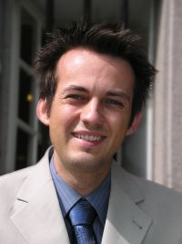

    

        

          
        

        

          Software Engineering 
          Department of Computer Science 3 
          RWTH Aachen University 
          Ahornstraße 55 
          D-52074 Aachen 
           
          <a href="mailto:schindler@se-rwth.de">schindler@se-rwth.de</a> 
           
          I'm now working at the <a href="https://www.maibornwolff.de/">MaibornWolff GmbH</a>
          in Munich, but you can still contact me using the e-mail-address above.
        

    

 


### Teaching:

- Excercises of lecture Model-based Software Engineering - WS 12/13 (Evaluation)
- Lab class of PhD course Generative Software Development
- at Vienna PhD School of Informatics, Technical University Vienna, Austria, SS 12
- Lab class of lecture Generative Software Engineering - SS 12
- Excercises of lecture Model-based Software Engineering - WS 11/12 (Evaluation)
- Lab class of lecture Generative Software Engineering - SS 10
- Lab class of lecture Generative Software Engineering - SS 09
- Excercises of lecture Model-based Software Engineering - WS 08/09 (Evaluation)
- Lab class Generative Software Engineering - WS 08/09
- Teamproject Software Systems Engineering - WS 07/08
- Lab class Software Engineering - WS 07/08
- Excercises of lecture Model-based Software Engineering - SS 07 (Evaluation)
- Excercises of lecture Model-based Software Engineering - SS 06 (Evaluation)
- Lab class Software Engineering - WS 05/06
- Overall organization (of all deparments) of lab class Software Engineering - SS 05
- Lab class Software Engineering - WS 04/05



### Current other tasks:

- Team Leader of the Modeling Group, Software Engineering Department, RWTH Aachen University
- Assistant Editor of Journal on [Software and Systems Modeling (SoSyM)](https://www.sosym.org/)



### Previous tasks:

At Software Engineering Department (SE, RWTH Aachen University) and Institute for Software Systems Engineering 
(SSE, Technical University Braunschweig)

- Administrator for web-, mail-, Exchange-, and VPN-server
- Administration of the SE- and SSE-mailinglists
- Person in charge for the documentation of teaching activities
(in the context of the "Lehrverpflichtungsverordnung" (LVVO) and "Leistungsorientierten 
Mittelzuweisung" (LOM) at the SSE including the coordination of all computer science departments 
at the Technical University Braunschweig)
- Representative of the faculty council, Carl-Friedrich-Gauß- Fakultät, Technical University Braunschweig, 
April 2005 to March 2007



### Projects:

- [MontiCore](https://monticore.github.io/monticore/) - Framework for modular development of textual domain-specific languages (DSLs),
research project, since Mai 2005
- Modelplex - Platform for the model-based development of software systems,
European project, September 2008 to May 2010
- Hardware decoupling for testing control software using the example of electronic control 
units diagnostics communication according to ISO 14229 and 15765,
industrial project, April 2005 to January 2006
- [AthaMap](http://www.athamap.de/) - Genome-wide map of potential transcription factor and small 
RNA binding sites in Arabidopsis thaliana,
research project in the area of bioinformatics, 2003 to 2006
- [PathoPlant](http://www.pathoplant.de/) - Database on plant-pathogen interactions,
research project in the area of bioinformatics, 2003 to 2006



### Tutorials:

- Bernhard Rumpe, Martin Schindler, Ingo Weisemöller
Generating Systems from UML
ACM/IEEE 14th International Conference on Model Driven Engineering Languages & Systems (MoDELS 2011), Wellington, NZ. October 2011.
- Bernhard Rumpe, Martin Schindler, Steven Völkel, Ingo Weisemöller
Agile Development with Domain Specific Languages
7th European Conference on Modelling Foundations and Applications (ECMFA 2011), Birmingham, UK. June 2011.
- Bernhard Rumpe, Martin Schindler, Steven Völkel, Ingo Weisemöller
Generative Software Development
32nd International Conference on Software Engineering (ICSE 2010), Cape Town, South Africa, May 2010.



### Publications:

  

