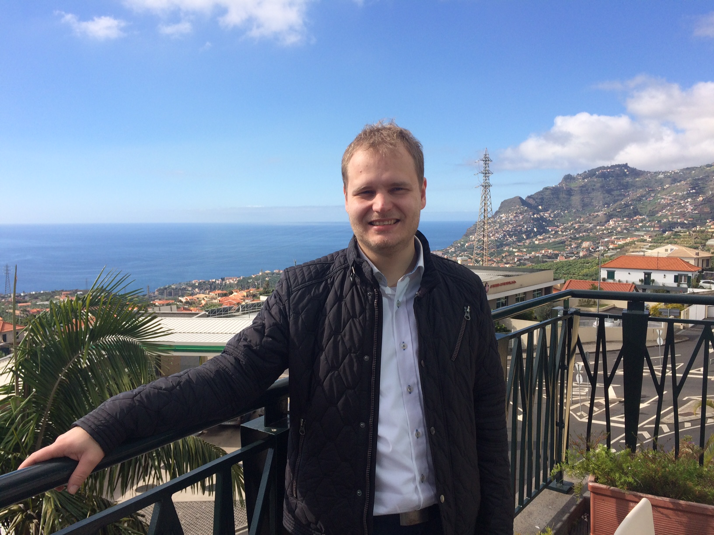

    

        

          
        

        

          Software Engineering 
          Department of Computer Science 3 
          RWTH Aachen University 
          Ahornstraße 55 
          D-52074 Aachen 
           
          +49 (241) 80-21319 
          <a href="mailto:vonwenckstern@se-rwth.de">vonwenckstern@se-rwth.de</a> 
           
          Room 4314 
           
          Project Leader <a href="https://www.se-rwth.de/materials/embeddedmontiarc/"> EmbeddedMontiArc </a>
        

    

 


### Research Prototype:

- [EmbeddedMontiArc - Modeling Language for Cyber-Physical Systems](https://www.se-rwth.de/materials/embeddedmontiarc/)



### Research Interests:

- Model-Driven Engineering
- Software Architecture Modeling
- Component and Connector Models (C&C Models)
- Verification of Software Architectures



### Publications:

  



### Certificates:

- [Certified Tester](https://www.se-rwth.de/staff/vonwenckstern/ISTQB_CertifiedTester.pdf)
- [Certified Scrum Master](https://www.se-rwth.de/staff/vonwenckstern/ScrumAlliance_CSM_Certificate.pdf)



### Supervised Bachelor/Master Thesis:

- Özen, Ahmet Tayfun: Evaluierung von Komponenten- und Konnektoren-Views, 2018
- Strepkov, Ievgen: Development of Web Playground for Component and Connector Models, 2018
- Schrick, Manuel: Visualisation of Textual Component and Connector Models, 2018
- Schneiders, Saschsa: Development of a C++ Generator for Embedded Modeling Languages, 2017
- Kahlert, Fabian: Extension of the C&C View Language and its Verification for Embedded Systems, 2017
- Mehlan, Ferdinand: Verification of Non-Functional Properties on Component and Connector Models, 2017
- Ho, Dinh-An: 3D Visualiszation API for Self-Driving Cars, 2017
- Heithoff, Malte: Model Checking of Self-Driving Cars Requirements against its Implementation, 2017
- Ronck, Jean-Marc: Creation of a Multi-User Online IDE for Domain-Specific Languages, 2017
- Shumeiko, Igor: Strategies to Reduce Variable Unfoldings in I/O-EFA Simulation Preorder Algorithm, 2017
- Bajana, Christian: Transformation von Simulink Stateflow Charts zu erweiterten endlichen Eingabe-/Ausgabeautomaten, 2016
- Ernst, David: Transformation von MontiArc-Modellen zu Kontrollflussgraphen, 2016
- Parashin, Vladimir: Fast Simulation Preorder Algorithm for Input/Output Extended Finite Automata, 2016
- Tolksdorf, Severin: Kontrollflussgraphenanalyse für das Verifikationstool, 2016
- Strodthoff, Nicolai: Strukturelle Analysen von MontiArc-Modellen mittels Z3-Solver, 2016
- Kogaj, Alexander: Formalisierung von Anforderungen zur Verhaltenskompatibilitätsprüfung, 2016
- Brunecker, Stefan: Transforming Simulink Models to MontiArc Models, 2016
- Tabone, Luca: Auflösen syntaktischer Konflikte während der Delta-Modellierung auf Basis der Semantik von FeatureDiagramm- und Delta-Sprachen, 2015



### Supervised Seminar Topics:

- Tabone, Luca: Feature Diagrams: A Survey and a Formal Semantics, 2015
- Deuster, Yannick: Comparing Different Algorithms Computing Maximal (Strong) Bisimulation, 2015
- Basavarajappa, Namitha Raj: Metrics for Non-Functional Requirements, 2015
- Kesmez, Deniz: Arduino Simulatoren, 2016
- Kulikov, Ilya: Different tracking methods for model cars in scale 1:58, 2016
- Kasyanov, Anton: Usage of Fast R-CNN for Model Cars in Scale 1:58, 2016
- Mokhtarian, Armin: OpenSimulator -- A tool to create your own city, street and car, 2016
- Müller, Jonathan: Generative Softwareentwicklung mit MontiCore -- Entwicklung einer einfachen domänenspezifischen Sprache zur Formalisierung von Erfüllbarkeitsproblemen, 2016
- Harisha, Pooja: MontiArc -- A modelling language for C&C models, 2016
- Hellwig, Alexander: Intelligent Autocompletion of MontiArc Models in Cloud9-IDE, 2016
- Huppertz, Martin: SymbolTable Concepts for MontiArc, 2016
- Mohanty, Punit: Parser Error Recovery Techniques in ANTLR, 2016
- Mades, Mirko: Syntax Highlighting for MontiArc in Cloud9-IDE, 2016
- Lüger, Markus: How to Visitor Patterns to automatically generate Outline for MontiArc models, 2016
- Netz, Lukas: Generating SVG Output files using Freemarker Engine, 2016
- Conraths, Thomas: Comparing different Layout Algorithms for C&C models, 2016
- Kehrbusch, Philipp: What is concrete and abstract syntax?, 2016
- Rahman, Khan Hafizur: Architecture Analysis & Design Language (AADL), 2017
- Hayat, Umair Abbas: Modelica, 2017
- Hellwig, Alexander: SysML, 2017
- Dalgic, Baran: Simulink, 2017
- Eeckels, Gregor: extensible Architecture Description Language for Software and Systems (xADL), 2017
- Ilov, Petro: Clone Detection, 2018
- Mokhtarian, Armin: 3D Modeling Using EmbeddedMontiArcMath, 2018
- Schneiders, Sascha: Modular and Optimized C++ Code-Generator for the Component and Connector Modeling Language MontiCAR, 2018
- Mehlan, Ferdinand: Improvements to OCL Implementation within the Monti-Core workbench, 2018
- Ronck, Jean-Marc: Creating a Multi-User Online-IDE without any server backend, 2018
- Kahlert, Fabian: Concepts to Extend the EmbeddedMontiArc Language Family with EmbeddedMontiArcApplication, 2018
- Schneiders, Sascha: Generator Composition Concepts for Extending the EmbeddedMontiArc Language Family with EmbeddedMontiArcApplication, 2018
- Heithoff, Malte: Case Study on EmbeddedMontiArc Language for PacMan, 2018
- Haller, Philipp: Case Study on EmbeddedMontiArc Language for SuperMario, 2018
- Mehlan, Ferdinand: Modellierung eines Wetterballons, 2018



### Tools/Videos:

- [Overview Video of EmbeddedMontiArcStudio](https://youtu.be/9Y54hGBR-rc)
- [Component and Connectors Views: Definition, Verification, Witnesses](https://youtu.be/AOB0DbUzl-s)
- [Defining Semantics of Extra-Functional-Properties in Component and Connector Models with OCL](https://youtu.be/m5uz7wmyTco)
- [Short introduction for EmbeddedMontiMath and how to generate C++ code](https://youtu.be/_lwVzIch2I4)
- [HaxPro: High Altitude eXploration Probe ("Hot Air Balloon measuring Weather Data": Chip Desgin, Frequency Testing, Test Flight)](https://youtu.be/6X9B8caS-Mg)
- [Controlling a Self-Driving Car with MontiArc](https://youtu.be/Ny4vkdhHKBk)
- [Bounded Model Checking of Self-Driving Cars Requirements against its Implementation](https://youtu.be/8xmDeqNXFGU)
- [Multi User Online IDE for DSLs on the example language MontiArc](https://youtu.be/xyjIC5F9VIo)
- [Simulating Platoon with 10 Cars](https://youtu.be/lJAfJKJf6Ko)
- [3D-Simulation of Autonomous Driving Vehicles -- Technology Overview](https://youtu.be/Ydk45aewSNE)
- [3D-Simulation of Autonomous Driving Vehicles -- Driving at Sun and Daytime](https://youtu.be/0O83-40uU7U)
- [3D-Simulation of Autonomous Driving Vehicles -- Driving at Rain and at Night](https://youtu.be/5k32aKOwmdk)
- [Transformation Tool for Simulink Models to MontiArc Models](https://youtu.be/ROmT3snE20Q)
