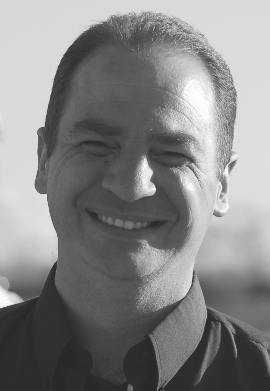

    

        

          
        

        

          Software Engineering 
          Department of Computer Science 3 
          RWTH Aachen University 
          Ahornstraße 55 
          D-52074 Aachen 
           
          <a href="mailto:maoz@se-rwth.de">maoz@se-rwth.de</a> 
        

    

 


### Information:

Shahar Maoz is an Associate Professor at the School of Computer Science in Tel Aviv University, 
where he heads the Software Modeling Laboratory. From 2010 to 2012 he was post-doc research fellow 
in RWTH Aachen University, Germany, with a postdoctoral fellowship from the Minerva Foundation. 
In 2015-2016 he spent a sabbatical at MIT CSAIL. Shahar's research interests are in software engineering, 
specifically in the use of models and formal methods for software evolution, model inference, testing, and synthesis. 
His work has been published in top software engineering and modeling conferences and journals. 
He is a recipient of an ERC Starting Grant for the development of synthesis technologies for reactive systems 
software engineers (project SYNTECH). For more information, see [https://www.cs.tau.ac.il/~maozs/](https://www.cs.tau.ac.il/~maozs/).