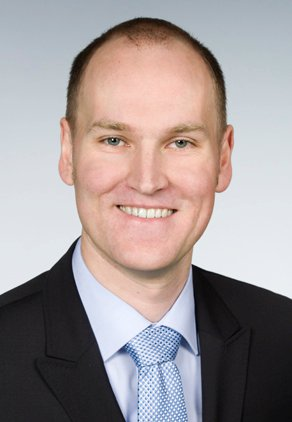

    

        

          
        

        

          Software Engineering 
          Department of Computer Science 3 
          RWTH Aachen University 
          Ahornstraße 55 
          D-52074 Aachen 
           
          +49 (241) 80-21301 
          <a href="mailto:heer@se-rwth.de">heer@se-rwth.de</a> 
           
          Room 4303
        

    

 


### Publications:

  



### Talks:

- Flexible Multi-Dimensional Visualization of Process Enactment Data. 5th Workshop on Business Process Intelligence (BPI 09), Ulm, 07.09.2009
- Support for Enactment and Monitoring of Engineering Design Processes. Symposium on Knowledge Engineering at the 8th World Congress of Chemical Engineering (WCCE8), Montreal, 26.08.2009
- Integrated Modeling, Simulation and Enactment of Design Processes in Chemical Engineering. Symposium on Knowledge Engineering at the 8th World Congress of Chemical Engineering (WCCE8), Montreal, 26.08.2009
- Workflows in Dynamic Development Processes. 1st International Workshop on Process Management for Highly Dynamic and Pervasive Scenarios (PM4HDPS), Mailand, 01.09.2009
- Dynamisches Prozessmanagement im Anlagenbau auf Basis von Comos. 5. Symposium Informationstechnologien für Entwicklung und Produktion in der Verfahrenstechnik, Aachen, 04.04.2008
- Dynamisches Prozessmanagement im Anlagenbau auf Basis von Comos. Comos MotionX Roadshow, Düsseldorf, 06.11.2007
- Incremental Ontology Integration. 10th International Conference on Enterprise Information Systems (ICEIS), Barcelona, 14.06.2008
- Algorithm and Tool for Ontology Integration based on Graph Rewriting. 3rd International Workshop and Symposium on Applications of Graph Transformation with Industrial Relevance (AGTIVE), Kassel, 10.10.2007



### Teaching:

- Proseminar: Innovative Services (SS 10)
- Seminar: Software-Architekturen - Verschiedene Formen und neue Aspekte (SS 09)
- Übungen zur Vorlesung: Einführung in die Softwaretechnik (WS 08/09)
- Projektpraktikum: Workflow-Based Services for eHomes (SS 08)
- Seminar: Prozessmanagement - Ansätze, Techniken, Sprachen und Werkzeuge (WS 07/08)
- Projektpraktikum: Prozessmanagement und Dokumentenintegration (SS 07)
- Übungen zur Vorlesung: Einführung in die Softwaretechnik (WS 06/07)

