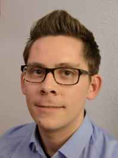

    

        

          
        

        

          Software Engineering 
          Department of Computer Science 3 
          RWTH Aachen University 
          Ahornstraße 55 
          D-52074 Aachen 
           
          <a href="mailto:greifenberg@se-rwth.de">greifenberg@se-rwth.de</a> 
        

    

 


### Publications:

  



### Supervised Theses:

#### Master:

- Generating Test Cases from Activity Diagrams in an industrial Context
- Automated architecture checking for MontiCore-based software development projects
- lntegration heterogener Datenmodelle unter Verwendung von Plugin-Generierung

#### Bachelor:

- Verwendung von OCL für die Artefaktmodellierung
- Integration der Artefaktstuktur-Analyse in die bestehende Infrastruktur
- Modellierung von Software-Werkzeugketten
- Dynamische, modellbasierte Abhängigkeitsanalyse von Java Systemen
- Webbasierte Visualisierung von Artefakt-Strukturen in der modellgetriebenen Softwareentwicklung
- Modellbasierte Abhängigkeitsanalyse von Generatorartefakten
- Ein Framework zur Analyse und Visualisierung von Artefaktabhängigkeiten in der Modellgetriebenen Softwareentwicklung
- Entwicklung eines RCP basierten Editors für heterogene Gebäudedaten



### Teaching:

- Seminar Seminar: Selected Topics in Software Engineering (Winter Term 2016)
- Proseminar Proseminar: Best Practices of Modern and Efficient Software Engineering (Winter Term 2016)
- Seminar Seminar: Selected Topics in Software Engineering (Summer Term 2016)
- Seminar Seminar: Selected Topics in Software Engineering (Winter Term 2015)
- Proseminar Proseminar: Best Practices of Modern and Efficient Software Engineering (Winter Term 2015)
- Seminar Seminar: Selected Topics in Software Engineering (Winter Term 2014)
- Proseminar Proseminar: Meilensteine Software Engineering (Winter Term 2014)
- Seminar Model Driven Design of large-scale Enterprise Information Systems (Summer Term 2013)

